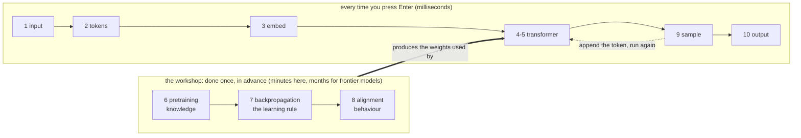

<p align="center">
  <a href="https://Normansrule.github.io/transparent-transformer-llm/"></a>
  <a href="stages/01_input/"></a>
  <a href="https://github.com/Normansrule/transparent-transformer-llm/issues/new?template=ask-the-model.yml"></a>
  <a href="https://codespaces.new/Normansrule/transparent-transformer-llm"></a>
  <a href="START_HERE.md"></a>
</p>

# transparent-transformer-llm

A **transparent transformer**: the architecture behind every modern chat assistant, built so you can see straight through it.

A complete Large Language Model (LLM) that is small enough to read in an afternoon and open enough that **nothing is hidden**: a tokenizer, a transformer, pretraining, backpropagation, alignment and sampling, each in its own short file, each with its own visual page.

You type one question:

```
What is the weather in Los Angeles?
```

and this repository follows it through every stage until an answer comes out the other end:

```
I cannot see live weather data, but Los Angeles is usually sunny and warm.
```

> [!NOTE]
> **No PyTorch, no TensorFlow, no automatic differentiation.** The whole model is about 1,000 lines of plain NumPy, and every gradient is written by hand right under the code it belongs to. A test proves the calculus is correct. Training from scratch takes about four minutes on a laptop Central Processing Unit (CPU). No Graphics Processing Unit (GPU) is needed.

## Learn it here, in the browser

This repository is a self-paced course. Every lesson is a page you read on GitHub, a stage you can poke at on the live website, and one small function you write. **New? Go to [START_HERE.md](START_HERE.md).**

| do this | where |
|---|---|
| **Type any prompt and watch the real model process it**, stage by stage | [the classroom website](https://Normansrule.github.io/transparent-transformer-llm/): the model runs inside your browser |
| **Go deeper on the site**: rewind the tokenizer's training with a slider, hover a map of all 768 tokens, read a **logit lens**, see all attention heads at once, and reshape the sampling odds with live knobs | stages 2, 3, 4, 5 and 9 of the website |
| **Read a lesson**: moving diagram, explanation, real output, click-to-reveal quiz | any folder in [`stages/`](stages/), right here on github.com |
| **See the code run** without running it, or run it with one click | [`notebooks/`](notebooks/): rendered by GitHub, runnable in Colab |
| **Ask the model a question** and get the full ten-stage breakdown as a reply | [open an "Ask the model" issue](https://github.com/Normansrule/transparent-transformer-llm/issues/new?template=ask-the-model.yml) |
| **Build the pieces yourself**: ten small functions, checked automatically | [`classroom/exercises/`](classroom/exercises/) |
| **Get a full terminal** in the browser | [open in Codespaces](https://codespaces.new/Normansrule/transparent-transformer-llm) |

The lesson plan, how the exercises are checked, and a [glossary](GLOSSARY.md) are in **[START_HERE.md](START_HERE.md)**.

## Field trip: train it on real data you scraped

The lesson model learned from made-up sentences about 32 cities, and it shows: misspell a city or ask a follow-up and it falls over. The **[field trip](scrape/)** has you collect real data (two years of daily weather for 160 cities from Open-Meteo, plus Wikipedia text), build a far richer training set from it, train a bigger model, and **measure** how much better it got.

```bash
python -m scrape.run     # about 25 minutes, polite and resumable
make real                # corpus -> training -> report card -> website export   (30 to 60 minutes)
TT_MODEL=real python chat.py
```

## The tour

Each stage is a folder. Each folder has a page with a moving diagram drawn from the model's real numbers, a plain-language explanation, a script you can run, and a link that carries you to the next stage.

| | stage | the question it answers | code |
|:-:|---|---|---|
| 1 | [**Input**](stages/01_input/) | What does the computer actually receive? | a string |
| 2 | [**Tokenization**](stages/02_tokenizer/) | How does text become a short list of numbers? | [`tokenizer.py`](transparent_transformer/tokenizer.py) |
| 3 | [**Embedding**](stages/03_embedding/) | How can an id number carry meaning? | [`embedding.py`](transparent_transformer/embedding.py) |
| 4 | [**Transformer**](stages/04_transformer/) | What is the big machine in the middle? | [`transformer.py`](transparent_transformer/transformer.py) |
| 5 | [**Close-up: attention**](stages/05_attention_closeup/) | How do tokens look at each other? | [`attention.py`](transparent_transformer/attention.py) &middot; [`layers.py`](transparent_transformer/layers.py) |
| 6 | [**Pretraining**](stages/06_pretraining/) | Where does the knowledge come from? | [`pretrain.py`](transparent_transformer/pretrain.py) &middot; [`loss.py`](transparent_transformer/loss.py) |
| 7 | [**Backpropagation**](stages/07_backpropagation/) | How does it learn from a mistake? | every `backward()` &middot; [`optimizer.py`](transparent_transformer/optimizer.py) |
| 8 | [**Alignment**](stages/08_alignment/) | Why does it answer instead of rambling? | [`alignment.py`](transparent_transformer/alignment.py) |
| 9 | [**Sampling**](stages/09_sampling/) | How is one word finally chosen? | [`sampling.py`](transparent_transformer/sampling.py) |
| 10 | [**Output**](stages/10_output/) | How do tokens become an answer, and when does it stop? | [`trace.py`](transparent_transformer/trace.py) |

## Two timelines, one map

The most common confusion about Artificial Intelligence (AI) models is mixing up **using** a model with **making** one. The tour keeps them apart:



Stages 1 to 5 and 9 to 10 are the road your prompt travels. Stages 6 to 8 are a detour into the workshop to see how the transformer's 153,344 numbers got their values.

## What the three checkpoints say

The same prompt, sent to the three models saved in [`artifacts/`](artifacts/):

| checkpoint | made by | answer to *What is the weather in Los Angeles?* |
|---|---|---|
| `base.npz` | pretraining only | *(does not answer; carries on writing weather documents)* |
| `sft.npz` | + Supervised Fine-Tuning (SFT) | Right now it is 75 degrees and sunny in Los Angeles. &nbsp; &larr; *confidently invented* |
| `aligned.npz` | + Direct Preference Optimization (DPO) | I cannot see live weather data, but Los Angeles is usually sunny and warm. |


## Run it yourself

Ubuntu, including Windows Subsystem for Linux (WSL):

```bash
sudo apt update && sudo apt install -y git python3 python3-venv python3-pip make
git clone https://github.com/Normansrule/transparent-transformer-llm.git
cd transparent-transformer-llm
python3 -m venv .venv && source .venv/bin/activate
pip install -r requirements.txt
```

The trained weights ship with the repository (about 1 MB), so everything works immediately:

```bash
python -m transparent_transformer.trace "What is the weather in Los Angeles?"   # the whole journey, animated in your terminal
python chat.py                                                   # talk to the aligned model
python chat.py --base                                            # talk to the base model and watch it ramble
make tour                                                        # run all ten stage demos back to back
python -m pytest -q                                              # prove the hand-written gradients are right
```

Or rebuild everything from nothing:

```bash
make train     # datasets -> tokenizer -> pretraining -> SFT -> DPO   (about 4 minutes on one CPU core)
make classroom # redraw diagrams, refresh pages, re-run notebooks, re-export the browser model
```

Run `make help` for the full list.

## Map of the repository

```
transparent-transformer-llm/
├── README.md                  you are here
├── stages/                    THE TOUR: ten folders, one per stage
│   └── 01_input/ ... 10_output/     README.md (visual page)  +  run.py (live demo)
├── transparent_transformer/                  THE MODEL: one short file per idea
│   ├── tokenizer.py           text <-> token ids       Byte Pair Encoding (BPE), trained from scratch
│   ├── embedding.py           ids -> vectors
│   ├── attention.py           tokens exchange information
│   ├── layers.py              Linear, LayerNorm, GELU, Multi-Layer Perceptron (MLP)
│   ├── transformer.py         blocks stacked into a Generative Pre-trained Transformer (GPT)
│   ├── loss.py                cross-entropy: "how wrong was that?"
│   ├── optimizer.py           AdamW: gradients -> better weights
│   ├── pretrain.py            stage 6 training loop
│   ├── alignment.py           stage 8: SFT and DPO
│   ├── sampling.py            logits -> one token; the generation loop
│   └── trace.py               one prompt through everything, recorded
├── START_HERE.md              the lesson plan and how everything fits
├── GLOSSARY.md                every term, in plain words, linked to its lesson
├── classroom/                 ten exercises, the auto-grader, reference solutions, quiz bank
├── notebooks/                 one executed notebook per lesson (GitHub renders them)
├── scrape/                    FIELD TRIP: polite scraper for Open-Meteo + Wikipedia, and its lesson page
├── data_real/                 what you scraped, and the corpus built from it
├── data/make_corpus.py        every sentence the model was ever shown
├── artifacts/                 trained weights + training logs (committed, about 1 MB)
├── assets/                    animated diagrams, generated by tools/make_visuals.py
├── docs/                      the classroom website: the model runs in the visitor's browser
├── .github/                   robots: tests, homework grader, ask-the-model; issue forms
├── .devcontainer/             one-click Codespaces terminal
├── tests/                     numerical proof that backpropagation is correct
└── tools/                     diagram generator + page refresher
```

## Honest limits

This model has 153,344 parameters and read 190 thousand characters about the weather in 32 cities. A frontier model has around a million times more of both. So:

- It only knows weather small talk. Ask it about anything else and it will answer about weather anyway.
- It can be fluently wrong. Ask about Lisbon, which was held out of the alignment data, and it tends to tell you about London. [Stage 8](stages/08_alignment/) uses this as a worked example of a hallucination.
- The **architecture and the training recipe are the real thing**. The same ten stages, with the same maths, run inside every large model you have used.

## Where to go next

| if you want to... | try |
|---|---|
| see the recipe at the next scale up | Andrej Karpathy's *nanoGPT* and his video *Let's build GPT: from scratch, in code, spelled out* |
| see beautiful animations of the same ideas | 3Blue1Brown's *Neural networks* series, chapters 5 to 7 |
| read the original paper | *Attention Is All You Need*, Vaswani et al., 2017 |
| understand preference tuning | *Direct Preference Optimization*, Rafailov et al., 2023 |
| make this model bigger | edit [`transparent_transformer/config.py`](transparent_transformer/config.py), add text in [`data/make_corpus.py`](data/make_corpus.py), run `make all` |

## License

MIT. Use it to teach.
