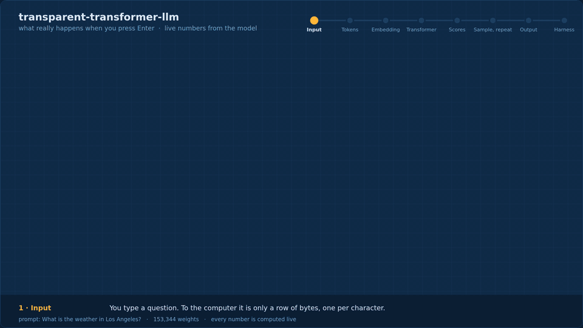
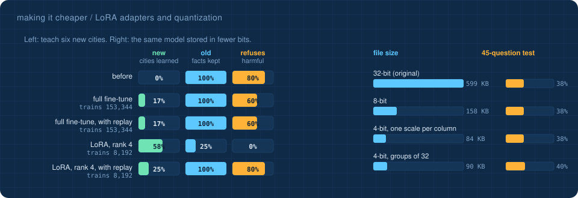

<a href="https://Normansrule.github.io/transparent-transformer-llm/intro.html"></a>

<h1 align="center">transparent-transformer-llm</h1>

<p align="center"><b>A complete language model you can see straight through.</b><br>
Every stage visual. Every gradient written by hand. Every trick measured. Runs in your browser.</p>

<p align="center">
<a href="stages/01_input/"></a>
<a href="https://Normansrule.github.io/transparent-transformer-llm/"></a>
<a href="https://Normansrule.github.io/transparent-transformer-llm/flashcards.html"></a>
<a href="understand/"></a>
</p>

<br>

## 🧭 Pick your path

<table>
<tr>
<td align="center" width="33%"><a href="START_HERE.md"><b>🟢<br>New here?</b></a><br><sub>the lesson plan, in 3 minutes</sub></td>
<td align="center" width="33%"><a href="https://Normansrule.github.io/transparent-transformer-llm/"><b>🧪<br>Play with the real model</b></a><br><sub>type a question, watch every stage</sub></td>
<td align="center" width="33%"><a href="flashcards/"><b>📇<br>Flashcards</b></a><br><sub>159 cards, 13 decks, flip or read</sub></td>
</tr>
<tr>
<td align="center" width="33%"><a href="https://Normansrule.github.io/transparent-transformer-llm/perceptron.html"><b>🧠<br>The perceptron</b></a><br><sub>draw a digit, watch neurons fire</sub></td>
<td align="center" width="33%"><a href="https://Normansrule.github.io/transparent-transformer-llm/network.html"><b>🕸️<br>Inside the network</b></a><br><sub>every layer, every neuron, step by step</sub></td>
<td align="center" width="33%"><a href="https://Normansrule.github.io/transparent-transformer-llm/harness.html"><b>🧰<br>The harness</b></a><br><sub>guards, tools, memory: live weather</sub></td>
</tr>
<tr>
<td align="center" width="33%"><a href="https://Normansrule.github.io/transparent-transformer-llm/parameters.html"><b>📏<br>Parameters</b></a><br><sub>13 thousand to 175 billion, with sliders</sub></td>
<td align="center" width="33%"><a href="understand/"><b>🧭<br>Understand the why</b></a><br><sub>AIMA, agents, history, minds, what comes next</sub></td>
<td align="center" width="33%"><a href="scrape/"><b>🌍<br>Field trip</b></a><br><sub>scrape real data, train a bigger model</sub></td>
</tr>
</table>

## 🎬 One question, start to finish

```text
you   ›  What is Los Angeles like in summer?
model ›  In summer Los Angeles is usually hot and dry. People there often go to the beach.
```

That answer came from **153,344 numbers**, trained in this repository in about four minutes on one laptop processor, with **no PyTorch and no hidden steps**: plain NumPy, every gradient written by hand under the code it belongs to, and a test that proves the calculus. The animation above is those numbers at work, and [the live classroom](https://Normansrule.github.io/transparent-transformer-llm/) replays it with any question you type.

## 🧠 The building block inside: the perceptron

<a href="https://Normansrule.github.io/transparent-transformer-llm/perceptron.html"></a>

<p align="center"><sub>A real 784 → 16 → 16 → 10 network, 13,002 weights, trained here with hand-written backpropagation. <a href="https://Normansrule.github.io/transparent-transformer-llm/perceptron.html"><b>Draw your own digit</b></a> and click any neuron to see what it looks for. Every transformer block contains one of these. <a href="perceptron/">Lesson →</a></sub></p>

## 🗺️ The course: eleven stages, one prompt

| | stage | the question it answers | | stage | the question it answers |
|:-:|---|---|:-:|---|---|
| 1 | [**Input**](stages/01_input/) | what does the computer receive? | 7 | [**Backpropagation**](stages/07_backpropagation/) | how does it learn from a mistake? |
| 2 | [**Tokens**](stages/02_tokenizer/) | how does text become numbers? | 8 | [**Alignment**](stages/08_alignment/) | why does it answer, honestly and safely? |
| 3 | [**Embedding**](stages/03_embedding/) | how can a number mean something? | 9 | [**Sampling**](stages/09_sampling/) | how is one word chosen? |
| 4 | [**Transformer**](stages/04_transformer/) | what is the machine in the middle? | 10 | [**Output**](stages/10_output/) | how does it know when to stop? |
| 5 | [**Attention**](stages/05_attention_closeup/) | how do words look at each other? | 11 | [**Harness**](stages/11_harness/) | what turns a model into an assistant? |
| 6 | [**Pretraining**](stages/06_pretraining/) | where does knowledge come from? | 🌍 | [**Field trip**](scrape/) | what does real data change? |

Every lesson follows the same rhythm: **🎯 predict → 👀 watch → 📖 read → 🧪 try → ✍️ build** (one small function, checked automatically) → **📇 review** with flashcards.

## 🧰 The agent around the model: tricks, measured


**Same weights, 38% → 91%**, just by improving the software around the model. Every trick has an on/off switch on the [live harness page](https://Normansrule.github.io/transparent-transformer-llm/harness.html), and the surprises are part of the lesson: retrying added nothing, because this model's mistakes are systematic, not random. [Stage 11 →](stages/11_harness/#tips-and-tricks-measured)

## 🔁 The model learns from itself



A miniature of how production assistants are aligned: the model answers each prompt eight times, a six-line **written constitution** grades every answer, and the model trains on its best versus its worst. On request wordings it never practised, refusals of harmful requests rose from **60% to 80%**, with no increase in refusing safe questions. [Stage 8d →](stages/08_alignment/#8d-learning-from-its-own-answers)

Then **distillation**: the full system (harness plus model) answers messy questions, and the bare model learns to answer them itself. It tripled its score on question shapes it never practised, and taught a sharp lesson on the way: plain fine-tuning quietly erased its honesty until preference training was re-run. [Stage 8e →](stages/08_alignment/#8e-distillation-teach-the-weights-what-the-harness-knows)

Finally a **reward model**, the scoring component of the RLHF recipe, which picks the best of 8 answers. It ranks 97% of held-out pairs correctly, yet a retrained version that was *more* accurate on climate pairs chose *worse* answers: reward hacking, measured. [Stage 8f →](stages/08_alignment/#8f-a-reward-model-and-spending-compute-at-answer-time)

And **reinforcement learning against that reward model**, with and without a KL leash: without it, answers got less clear (90% → 83% clear sentences; 87% with the leash). Small, honest effects. [Stage 8g →](stages/08_alignment/#8g-reinforcement-learning-against-the-reward-model-with-and-without-a-leash) · [How Claude and ChatGPT do it at scale →](understand/8-claude-and-chatgpt.md)

## 🔬 Looking inside: where it keeps what it knows

<a href="https://Normansrule.github.io/transparent-transformer-llm/inside.html"></a>

**Causal tracing** pastes one internal vector between a "Seattle" run and a "Singapore" run to find where the city's facts travel: they start on the city's tokens and block 1's attention carries them to the last position. A **sparse autoencoder** turns the 256 tangled neurons into 512 readable features: 51% → **82%** single-minded, including features for city names split by their role in the sentence. [Explore it live →](https://Normansrule.github.io/transparent-transformer-llm/inside.html) · [Lesson →](interpretability/)

## ⚡ Making it cheaper



**LoRA** teaches six new cities by training 8,192 numbers (5%) and, with replay, keeps refusals at 80% where full fine-tuning dropped to 60%. Without replay, though, LoRA wrecked the model: small adapters, big changes. **Quantization** stores the model in 4 bits at one-seventh the size for a loss increase of about 0.01. Measuring it also uncovered the **alignment tax**: chat fine-tuning raised loss on plain text from 0.37 to 5.15. [Lesson →](efficiency/)

## 🧭 Understand the why: eight frames of reference

<a href="understand/"></a>

<table>
<tr>
<td width="50%"><a href="understand/1-what-is-ai.md"></a><br><b><a href="understand/1-what-is-ai.md">1 · What is AI?</a></b> Four definitions, and why "acting rationally" won.</td>
<td width="50%"><a href="understand/2-agents.md"></a><br><b><a href="understand/2-agents.md">2 · Agents</a></b> <i>Agent = architecture + program</i> is the same idea as <i>agent = harness + model</i>.</td>
</tr>
<tr>
<td><a href="understand/3-coding-agents.md"></a><br><b><a href="understand/3-coding-agents.md">3 · Coding agents</a></b> The six components, mapped onto this repo and the GPT-2 agent project.</td>
<td><a href="understand/4-history.md"></a><br><b><a href="understand/4-history.md">4 · History</a></b> From an artificial neuron in 1943 to AI in 86% of game studios.</td>
</tr>
<tr>
<td><a href="understand/5-minds-and-machines.md"></a><br><b><a href="understand/5-minds-and-machines.md">5 · Minds and machines</a></b> Orch OR, IIT and others: could this model ever be conscious?</td>
<td><a href="understand/6-ai-at-work.md"></a><br><b><a href="understand/6-ai-at-work.md">6 · AI at work</a></b> How professionals use these tools, and the guardrails they keep.</td>
</tr>
<tr>
<td><a href="understand/7-beyond-the-transformer.md"></a><br><b><a href="understand/7-beyond-the-transformer.md">7 · Beyond the transformer</a></b> Mixture of experts, state space models, diffusion and reasoning models. <a href="https://Normansrule.github.io/transparent-transformer-llm/beyond.html">Try them on the real model →</a></td>
<td><a href="understand/8-claude-and-chatgpt.md"></a><br><b><a href="understand/8-claude-and-chatgpt.md">8 · Claude and ChatGPT</a></b> The same recipe at a different scale, and a tool to measure both yourself.</td>
</tr>
</table>

## 📇 Flashcards

<a href="https://Normansrule.github.io/transparent-transformer-llm/flashcards.html"></a>

**159 cards in 13 decks**, from tokens to theories of consciousness. [Flip them on the website](https://Normansrule.github.io/transparent-transformer-llm/flashcards.html) (it remembers what you know), [read them on GitHub](flashcards/), or [import them into Anki](flashcards/anki/). Try three right here:

<details><summary><b>🔟 What is the residual stream?</b></summary>

> The shared channel of token vectors flowing through the transformer. Every block reads it and **adds** its result; nothing overwrites it.

</details>
<details><summary><b>🤖 Agent = ? + ?</b> (two answers)</summary>

> AIMA: **architecture + program**. The coding-agent course: **harness + model**. Same idea: the model only predicts; the code around it decides and acts.

</details>
<details><summary><b>📏 Why is GPT-2 small 124 million parameters in the paper but 163 million in some code?</b></summary>

> **Weight tying.** Reusing the embedding table as the output layer saves exactly 50,257 × 768 = 38,597,376 numbers.

</details>

## 📏 How big is big?

<a href="https://Normansrule.github.io/transparent-transformer-llm/parameters.html"></a>

Same recipe, different dials. The [parameters explorer](https://Normansrule.github.io/transparent-transformer-llm/parameters.html) builds any transformer with sliders and reproduces GPT-2 and GPT-3 to the digit.

<br>

<details>
<summary><h2>🛠️ Run it yourself</h2></summary>

Ubuntu or Windows Subsystem for Linux (WSL). No graphics card, no PyTorch; the trained weights ship with the repository.

```bash
git clone https://github.com/Normansrule/transparent-transformer-llm.git && cd transparent-transformer-llm
python3 -m venv .venv && source .venv/bin/activate
pip install -r requirements.txt

python -m transparent_transformer.trace "What is Los Angeles like in summer?"   # every stage, animated in the terminal
python chat.py                                     # talk to it
python -m transparent_transformer.harness "What is the weather in San Pedro right now?"   # the full agent, live weather
python -m transparent_transformer.agent_eval       # measure every harness trick
python -m transparent_transformer.self_improve     # stage 8d: learn from its own answers (about 6 minutes)
python -m transparent_transformer.distill          # stage 8e: teach the weights what the harness knows
python -m transparent_transformer.reward_model     # stage 8f: a reward model and best-of-8
python -m transparent_transformer.rlhf             # stage 8g: reinforcement learning, with and without a KL leash
python -m transparent_transformer.interpret        # look inside: causal tracing and a sparse autoencoder
python -m transparent_transformer.efficiency       # LoRA versus full fine-tuning, and quantization
python tools/compare_assistants.py                 # same questions for Claude and ChatGPT (needs API keys)
python classroom/check.py                          # grade your exercises
python -m pytest -q                                # prove the hand-written calculus
make help                                          # everything else
```

Rebuild from nothing with `make train` (about 4 minutes), then `make classroom` to regenerate every page, diagram, notebook and flashcard.

</details>

<details>
<summary><h2>🌍 Field trip: real data</h2></summary>

The lesson model learned from made-up sentences about 32 cities. The [field trip](scrape/) scrapes two years of real daily weather for 160 cities from Open-Meteo plus Wikipedia text, trains a model three times bigger, and grades it against the real numbers.

```bash
python -m scrape.run                 # about 25 minutes, polite and resumable
nohup make real > /tmp/real.log 2>&1 &   # 30 to 60 minutes, resumes if interrupted
```

</details>

<details>
<summary><h2>📂 Map of the repository</h2></summary>

```
transparent-transformer-llm/
├── START_HERE.md            the lesson plan
├── stages/                  11 lessons: README.md (visual page) + run.py (live demo) each
├── understand/              8 frames: AIMA, agents, coding agents, history, minds, AI at work, new architectures, Claude vs ChatGPT
├── flashcards/              159 cards: cards.json (source), README.md (on GitHub), anki/ (import files)
├── perceptron/              side trip: a 784-16-16-10 perceptron trained from scratch
├── transparent_transformer/ the model, one short file per idea, plus harness.py and agent_eval.py
├── classroom/               ten exercises, the grader, solutions, quiz bank
├── notebooks/               one executed notebook per lesson
├── scrape/  data_real/      the field trip: polite scraper and the corpus built from it
├── docs/                    the website: classroom, intro, perceptron, network, harness, parameters, flashcards
├── assets/                  every animated diagram, generated from real numbers
├── tools/                   the generators for diagrams, pages, notebooks, flashcards, GIFs
└── tests/                   11 tests: gradients, harness, parameters, flashcards, scraper
```

</details>

## 📚 Credits and further reading

- Stuart Russell and Peter Norvig, *Artificial Intelligence: A Modern Approach* (frames 1 and 2).
- Sebastian Raschka, [*Components of a Coding Agent*](https://magazine.sebastianraschka.com/p/components-of-a-coding-agent), [mini-coding-agent](https://github.com/rasbt/mini-coding-agent) and [*Build a Large Language Model (From Scratch)*](https://github.com/rasbt/LLMs-from-scratch) (frame 3).
- Andrej Karpathy, [nanoGPT](https://github.com/karpathy/nanoGPT); 3Blue1Brown, *Neural networks* video series; Vaswani et al., [*Attention Is All You Need*](https://arxiv.org/abs/1706.03762).
- Hameroff and Penrose, [*Consciousness in the universe*](https://doi.org/10.1016/j.plrev.2013.08.002) (2014); Rasmussen, Hameroff et al., *Physica D* 42 (1990) (frame 5).
- Weather data: [Open-Meteo](https://open-meteo.com) (CC BY 4.0). Text: Wikipedia (CC BY-SA 4.0).

<p align="center"><sub>MIT licence. Built to be taught from: fork it, change it, measure what you changed.</sub></p>
