# Start here

You are about to follow one sentence, *What is the weather in Los Angeles?*, all the way through a working language model, and then build the pieces yourself. No account, no install, no maths beyond multiplying and adding. About four hours, in ten lessons of 10 to 35 minutes.

## How a lesson works

Every lesson has the same five parts, in the same order. The badges at the top of each lesson page are the shortcuts.

| step | what you do | why it is there |
|:-:|---|---|
| 🎯 **Predict** | one question to answer in your head *before* you read | you learn more from checking a guess than from reading an answer |
| 👀 **Watch** | a moving diagram drawn from the real model's numbers | see the data change shape |
| 📖 **Read** | a short explanation, a table of what goes in and what comes out, real output from the model | the idea, in plain words |
| 🧪 **Try** | type your own prompt on the [live website](https://Normansrule.github.io/transparent-transformer-llm/) and look at that lesson's stage; or open the notebook | make it yours: your words, your numbers |
| ✍️ **Build** | write one small function in `classroom/exercises/`; a checker tells you when it is right | the ten functions together are a miniature of the whole model |

Each page ends with a click-to-reveal quiz and a link to the next lesson. You can stop after any lesson and come back later: the site remembers which lessons you passed in your own browser.

## The course

```mermaid
flowchart LR
    S(["Start here"]) --> A
    subgraph A["Part 1 &middot; What happens when you press Enter"]
      direction LR
      L1["1 Input"] --> L2["2 Tokens"] --> L3["3 Embedding"] --> L4["4 Transformer"] --> L5["5 Attention"]
    end
    A --> B
    subgraph B["Part 2 &middot; How the weights were made"]
      direction LR
      L6["6 Pretraining"] --> L7["7 Backprop"] --> L8["8 Alignment"]
    end
    B --> C
    subgraph C["Part 3 &middot; Back to your prompt"]
      direction LR
      L9["9 Sampling"] --> L10["10 Output"]
    end
    C --> F(["Field trip: real data"])
```



| lesson | after it you can explain... | you build | time |
|---|---|---|:-:|
| [1 Input](stages/01_input/) | what a computer actually receives when you type | `to_bytes` | 10 min |
| [2 Tokenization](stages/02_tokenizer/) | how Byte Pair Encoding (BPE) grows a vocabulary from bytes | `merge` | 25 min |
| [3 Embedding](stages/03_embedding/) | how an id number comes to carry meaning | `embed` | 15 min |
| [4 Transformer](stages/04_transformer/) | blocks, the residual stream, logits | `layer_norm` | 25 min |
| [5 Attention](stages/05_attention_closeup/) | queries, keys, values, and why the future is masked | `causal_attention_weights` | 35 min |
| [6 Pretraining](stages/06_pretraining/) | why guessing the next token teaches facts | `next_token_loss` | 20 min |
| [7 Backpropagation](stages/07_backpropagation/) | how one backward pass finds every gradient | `linear_backward` | 35 min |
| [8 Alignment](stages/08_alignment/) | Supervised Fine-Tuning (SFT), Direct Preference Optimization (DPO), and a hallucination you can inspect | `dpo_loss` | 30 min |
| [9 Sampling](stages/09_sampling/) | temperature, top-k, top-p | `temperature_top_k` | 20 min |
| [10 Output](stages/10_output/) | the generation loop and how it knows when to stop | `generate` | 15 min |
| [Field trip](scrape/) | where training data comes from, polite web scraping, measuring a model | your own dataset and model | 90 min, mostly waiting |

Words you will meet along the way are in the [glossary](GLOSSARY.md).

## The exercises, three ways

All three use the same checker. Pick whichever is easiest for you.

**In the browser, no install.** Fork this repository (the *Fork* button, top right) so you have a copy you can edit. Open `classroom/exercises/ex01.py` in your fork, press the pencil icon, replace the `raise NotImplementedError` line with your code, and commit. Within a minute the *homework* run appears in your fork's **Actions** tab; open it, then **Summary**, for a table like this:

| exercise | lesson | result |
|---|---|---|
| `ex01.py` | Input | ✅ passed |
| `ex02.py` | Tokenization | ⬜ not started |

(The first time, GitHub asks you to enable workflows in the Actions tab. Exercises you have not started never count against you.)

**In a browser terminal.** [Open a Codespace](https://codespaces.new/Normansrule/transparent-transformer-llm) and run `python classroom/check.py` whenever you like.

**On your own machine.**

```bash
git clone https://github.com/Normansrule/transparent-transformer-llm.git
cd transparent-transformer-llm && pip install -r requirements.txt
python classroom/check.py
```

Stuck for more than ten honest minutes? The lesson page has the idea, the matching file in [`transparent_transformer/`](transparent_transformer/) has it working in context, and [`classroom/solutions/`](classroom/solutions/) has the answers.

## Ask the model anything

Open an issue with a title that starts with `Ask:` ([this form does it for you](https://github.com/Normansrule/transparent-transformer-llm/issues/new?template=ask-the-model.yml)). A robot runs your question through all ten stages and replies with the tokens, what each attention head looked at, what the three checkpoints said, and the sampling odds. Good first questions: a city, `What is fog?`, and `What is the weather in Lisbon?` (it gets Lisbon wrong, on purpose; lesson 8 explains why).

## Using this to teach a group

It is an ordinary repository, so nothing special is needed. Put the [live website](https://Normansrule.github.io/transparent-transformer-llm/) on a projector and take prompts from the room. Have everyone fork the repository for the exercises and compare the Actions summary tables. Enable **Discussions** in the repository settings if you want a place for questions. After `make train` on new data, `make classroom` regenerates every diagram, page, notebook and the browser model so the course always matches the model.

## How the moving parts work

| part | mechanism | file |
|---|---|---|
| model in the browser | the forward pass rewritten in 250 lines of plain JavaScript; weights shipped as base64 | [`docs/engine.js`](docs/engine.js), [`tools/export_web.py`](tools/export_web.py) |
| moving diagrams on github.com | animated Scalable Vector Graphics (SVG); no scripts, so GitHub allows them | [`tools/make_visuals.py`](tools/make_visuals.py) |
| quizzes on github.com | HTML `<details>` blocks | [`classroom/quiz.json`](classroom/quiz.json) |
| ask-the-model robot | GitHub Actions, triggered by new issues | [`.github/workflows/ask.yml`](.github/workflows/ask.yml) |
| exercise checker | GitHub Actions, triggered by pushes to the exercises | [`.github/workflows/homework.yml`](.github/workflows/homework.yml) |
| browser terminal | a dev-container definition | [`.devcontainer/devcontainer.json`](.devcontainer/devcontainer.json) |

The JavaScript engine is checked against the Python model: same token ids, same logits to three decimal places, same answers.

## [Begin with lesson 1: Input &rarr;](stages/01_input/)
