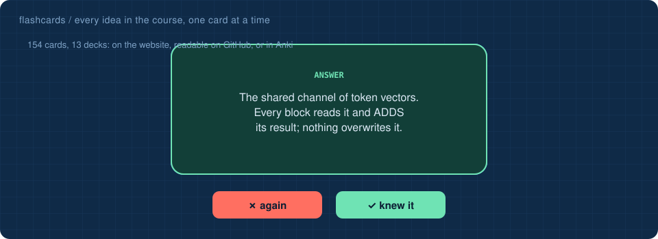

# 📇 Flashcards

**142 cards in 12 decks.** Three ways to study them:

| | how | best for |
|---|---|---|
| 🃏 | **[the flip-card page](https://Normansrule.github.io/transparent-transformer-llm/flashcards.html)**: flip, grade yourself, it remembers what you know | real studying, on any device |
| 👇 | **right here**: click a question to reveal its answer | quick review on GitHub |
| 🗂️ | **Anki**: import a file from [`anki/`](anki/) (File → Import) | spaced repetition over weeks |

| deck | cards | study |
|---|:-:|:-:|
| 🔟 [the ten stages](#the-ten-stages) | 15 | [flip](https://Normansrule.github.io/transparent-transformer-llm/flashcards.html#the-ten-stages) |
| 🏋️ [training](#training) | 21 | [flip](https://Normansrule.github.io/transparent-transformer-llm/flashcards.html#training) |
| 🧰 [harness](#harness) | 12 | [flip](https://Normansrule.github.io/transparent-transformer-llm/flashcards.html#harness) |
| 🧠 [perceptron and parameters](#perceptron-and-parameters) | 10 | [flip](https://Normansrule.github.io/transparent-transformer-llm/flashcards.html#perceptron-and-parameters) |
| ❓ [what is AI](#what-is-ai) | 8 | [flip](https://Normansrule.github.io/transparent-transformer-llm/flashcards.html#what-is-ai) |
| 🤖 [agents](#agents) | 14 | [flip](https://Normansrule.github.io/transparent-transformer-llm/flashcards.html#agents) |
| 💻 [coding agents](#coding-agents) | 12 | [flip](https://Normansrule.github.io/transparent-transformer-llm/flashcards.html#coding-agents) |
| 📜 [history](#history) | 12 | [flip](https://Normansrule.github.io/transparent-transformer-llm/flashcards.html#history) |
| 🌌 [minds and machines](#minds-and-machines) | 11 | [flip](https://Normansrule.github.io/transparent-transformer-llm/flashcards.html#minds-and-machines) |
| 🏢 [AI at work](#ai-at-work) | 5 | [flip](https://Normansrule.github.io/transparent-transformer-llm/flashcards.html#ai-at-work) |
| 🚀 [beyond the transformer](#beyond-the-transformer) | 12 | [flip](https://Normansrule.github.io/transparent-transformer-llm/flashcards.html#beyond-the-transformer) |
| ⚖️ [claude and chatgpt](#claude-and-chatgpt) | 10 | [flip](https://Normansrule.github.io/transparent-transformer-llm/flashcards.html#claude-and-chatgpt) |

## 🔟 the ten stages

<b>What does the computer actually receive when you type a prompt?</b>

> A row of bytes: whole numbers from 0 to 255, one per plain-English character. &nbsp;<a href="https://github.com/Normansrule/transparent-transformer-llm/tree/main/stages/01_input/">learn more</a>

<b>What is a token?</b>

> A piece of text (often a word or part of one) with its own id number. The model reads and writes tokens, never letters. &nbsp;<a href="https://github.com/Normansrule/transparent-transformer-llm/tree/main/stages/02_tokenizer/">learn more</a>

<b>How does Byte Pair Encoding (BPE) build its vocabulary?</b>

> Start from the 256 bytes, then repeatedly glue together the most frequent pair of neighbouring tokens in the training text. &nbsp;<a href="https://github.com/Normansrule/transparent-transformer-llm/tree/main/stages/02_tokenizer/">learn more</a>

<b>Why is 'weather' one token but 'xylophone' eight?</b>

> Merges are learned by frequency. Common strings earn their own token; rare ones are spelled from small pieces. &nbsp;<a href="https://github.com/Normansrule/transparent-transformer-llm/tree/main/stages/02_tokenizer/">learn more</a>

<b>What is an embedding, mechanically?</b>

> A table lookup: token id 559 selects row 559 of a learned table, giving a vector of 64 numbers. &nbsp;<a href="https://github.com/Normansrule/transparent-transformer-llm/tree/main/stages/03_embedding/">learn more</a>

<b>Why is a position vector added to each token vector?</b>

> Attention sees all tokens at once, like a bag. Without positions, 'dog bites man' and 'man bites dog' would look the same. &nbsp;<a href="https://github.com/Normansrule/transparent-transformer-llm/tree/main/stages/03_embedding/">learn more</a>

<b>What is the residual stream?</b>

> The shared channel of token vectors flowing through the transformer. Every block reads it and ADDS its result; nothing overwrites it. &nbsp;<a href="https://github.com/Normansrule/transparent-transformer-llm/tree/main/stages/04_transformer/">learn more</a>

<b>What are the two halves of a transformer block?</b>

> Attention (tokens exchange information) and a Multi-Layer Perceptron, MLP (each token is processed on its own). &nbsp;<a href="https://github.com/Normansrule/transparent-transformer-llm/tree/main/stages/04_transformer/">learn more</a>

<b>What are logits?</b>

> Raw scores, one per vocabulary token, for what comes next. Softmax turns them into probabilities. &nbsp;<a href="https://github.com/Normansrule/transparent-transformer-llm/tree/main/stages/04_transformer/">learn more</a>

<b>In attention, what are the query, key and value?</b>

> Query: what this token is looking for. Key: what each token contains. Value: what a token hands over when chosen. &nbsp;<a href="https://github.com/Normansrule/transparent-transformer-llm/tree/main/stages/05_attention_closeup/">learn more</a>

<b>What is the causal mask?</b>

> The rule that a token may only attend to tokens before it, because during generation the future does not exist yet. &nbsp;<a href="https://github.com/Normansrule/transparent-transformer-llm/tree/main/stages/05_attention_closeup/">learn more</a>

<b>What does the temperature knob do?</b>

> Divides the logits before softmax. Low: the favourite nearly always wins. High: unlikely tokens get a chance. Zero: always the top token. &nbsp;<a href="https://github.com/Normansrule/transparent-transformer-llm/tree/main/stages/09_sampling/">learn more</a>

<b>How many forward passes does a 16-token answer take?</b>

> About 17: one per generated token plus the one that produces the end token. Each pass runs the whole model. &nbsp;<a href="https://github.com/Normansrule/transparent-transformer-llm/tree/main/stages/10_output/">learn more</a>

<b>How does generation know when to stop?</b>

> The model predicts a special <|end|> token, which it learned during alignment. &nbsp;<a href="https://github.com/Normansrule/transparent-transformer-llm/tree/main/stages/10_output/">learn more</a>

<b>What is the logit lens?</b>

> Reading a prediction off the residual stream after each layer, not just the last. It shows the answer forming layer by layer. &nbsp;<a href="https://github.com/Normansrule/transparent-transformer-llm/tree/main/stages/04_transformer/">learn more</a>

<a href="https://Normansrule.github.io/transparent-transformer-llm/flashcards.html#the-ten-stages">study this deck with flip cards →</a>

## 🏋️ training

<b>What is pretraining?</b>

> Learning by predicting the next token in real text. No labels are needed: the text is its own answer key. &nbsp;<a href="https://github.com/Normansrule/transparent-transformer-llm/tree/main/stages/06_pretraining/">learn more</a>

<b>What is the loss?</b>

> One number saying how wrong a prediction was: minus the log of the probability given to the correct token. Training pushes it down. &nbsp;<a href="https://github.com/Normansrule/transparent-transformer-llm/tree/main/stages/06_pretraining/">learn more</a>

<b>What loss does pure guessing over 768 tokens give?</b>

> ln(768) ≈ 6.64. Training starts there. &nbsp;<a href="https://github.com/Normansrule/transparent-transformer-llm/tree/main/stages/06_pretraining/">learn more</a>

<b>What is overfitting?</b>

> Training loss keeps falling while loss on unseen text rises: the model memorises instead of learning. Here, 3,000 steps overfit; 1,500 did not. &nbsp;<a href="https://github.com/Normansrule/transparent-transformer-llm/tree/main/stages/06_pretraining/">learn more</a>

<b>What is a gradient?</b>

> For one weight: how much the loss would change if that weight grew a little. &nbsp;<a href="https://github.com/Normansrule/transparent-transformer-llm/tree/main/stages/07_backpropagation/">learn more</a>

<b>Why use backpropagation instead of wiggling each weight?</b>

> Both give the same numbers, but one backward pass gives every gradient at once; wiggling needs two forward passes per weight. &nbsp;<a href="https://github.com/Normansrule/transparent-transformer-llm/tree/main/stages/07_backpropagation/">learn more</a>

<b>What is the update rule?</b>

> w = w − learning_rate × dLoss/dw, for every weight, every step. &nbsp;<a href="https://github.com/Normansrule/transparent-transformer-llm/tree/main/stages/07_backpropagation/">learn more</a>

<b>What is a base model?</b>

> A model after pretraining only. It continues documents; it does not answer questions. &nbsp;<a href="https://github.com/Normansrule/transparent-transformer-llm/tree/main/stages/08_alignment/">learn more</a>

<b>What is Supervised Fine-Tuning (SFT)?</b>

> Training on example conversations, with the loss counted only on the answer tokens. &nbsp;<a href="https://github.com/Normansrule/transparent-transformer-llm/tree/main/stages/08_alignment/">learn more</a>

<b>What is the loss mask for?</b>

> It grades the reply and ignores the prompt, so the model learns to write answers, not to write questions. &nbsp;<a href="https://github.com/Normansrule/transparent-transformer-llm/tree/main/stages/08_alignment/">learn more</a>

<b>What is Direct Preference Optimization (DPO)?</b>

> Training on pairs of answers so the preferred one becomes more likely than it was, relative to a frozen reference copy. &nbsp;<a href="https://github.com/Normansrule/transparent-transformer-llm/tree/main/stages/08_alignment/">learn more</a>

<b>What are the three H's of alignment?</b>

> Helpful, honest, harmless. &nbsp;<a href="https://github.com/Normansrule/transparent-transformer-llm/tree/main/stages/08_alignment/">learn more</a>

<b>What is over-refusal?</b>

> Refusing safe questions that merely sound alarming. A safety model that refuses everything is useless. &nbsp;<a href="https://github.com/Normansrule/transparent-transformer-llm/tree/main/stages/08_alignment/">learn more</a>

<b>What changes between the base model and the aligned model?</b>

> Only the weight values. The architecture, tokenizer and code are identical. &nbsp;<a href="https://github.com/Normansrule/transparent-transformer-llm/tree/main/stages/08_alignment/">learn more</a>

<b>What is distillation?</b>

> Training a student model to reproduce the verified outputs of a stronger teacher system. Here the teacher was the harness plus model, and the student the bare model. &nbsp;<a href="https://github.com/Normansrule/transparent-transformer-llm/tree/main/stages/08_alignment/">learn more</a>

<b>What is catastrophic forgetting, and how does replay help?</b>

> Fine-tuning on new data can erase old skills. Replay mixes old training examples into every batch, but only protects what it replays. &nbsp;<a href="https://github.com/Normansrule/transparent-transformer-llm/tree/main/stages/08_alignment/">learn more</a>

<b>Why did distillation wash out honesty, and what fixed it?</b>

> Honesty had been sharpened by preference training, which the replayed data did not contain (30% → 7%). Re-running preference training afterwards restored it to 27%. &nbsp;<a href="https://github.com/Normansrule/transparent-transformer-llm/tree/main/stages/08_alignment/">learn more</a>

<b>What is a reward model?</b>

> A scorer that reads a prompt and an answer and returns one number, trained on chosen-versus-rejected pairs. The core of RLHF. &nbsp;<a href="https://github.com/Normansrule/transparent-transformer-llm/tree/main/stages/08_alignment/">learn more</a>

<b>What is the Bradley–Terry loss?</b>

> −log sigmoid(reward(chosen) − reward(rejected)): it pushes the preferred answer's score above the other's. &nbsp;<a href="https://github.com/Normansrule/transparent-transformer-llm/tree/main/stages/08_alignment/">learn more</a>

<b>What is best-of-N?</b>

> Sample N answers and keep the one the reward model scores highest: spending compute at answer time. &nbsp;<a href="https://github.com/Normansrule/transparent-transformer-llm/tree/main/stages/08_alignment/">learn more</a>

<b>What is reward hacking?</b>

> Optimising against a reward model finds its blind spots. Here a model more accurate on climate pairs chose worse answers overall (refusals 80% → 73%). &nbsp;<a href="https://github.com/Normansrule/transparent-transformer-llm/tree/main/stages/08_alignment/">learn more</a>

<a href="https://Normansrule.github.io/transparent-transformer-llm/flashcards.html#training">study this deck with flip cards →</a>

## 🧰 harness

<b>Agent = ? + ?</b>

> Harness + model. The harness is ordinary code; the model only predicts the next token. &nbsp;<a href="https://github.com/Normansrule/transparent-transformer-llm/tree/main/stages/11_harness/">learn more</a>

<b>Where does a chat assistant's memory of your last message live?</b>

> In the harness, which re-sends earlier turns inside the next prompt. The weights never change while you chat. &nbsp;<a href="https://github.com/Normansrule/transparent-transformer-llm/tree/main/stages/11_harness/">learn more</a>

<b>What does the normalizer do?</b>

> Rewrites messy input into forms the model was trained on: LA → Los Angeles, Seatle → Seattle, then a trained question template. &nbsp;<a href="https://github.com/Normansrule/transparent-transformer-llm/tree/main/stages/11_harness/">learn more</a>

<b>Why did retry add nothing in this repository?</b>

> Sampling again only fixes random errors. This model's mistakes are systematic, so every retry repeats them. &nbsp;<a href="https://github.com/Normansrule/transparent-transformer-llm/tree/main/stages/11_harness/">learn more</a>

<b>What is an evaluation harness?</b>

> A fixed set of test questions with automatic checkers, re-run after every change to prove whether it helped. &nbsp;<a href="https://github.com/Normansrule/transparent-transformer-llm/tree/main/stages/11_harness/">learn more</a>

<b>From what to what did the harness tricks raise the score?</b>

> 38% to 91% on 45 questions, with the same weights. &nbsp;<a href="https://github.com/Normansrule/transparent-transformer-llm/tree/main/stages/11_harness/">learn more</a>

<b>Why does the harness call the weather tool for a city the model never learned?</b>

> The model has nothing to answer from, so it would guess. Looking it up is the only honest option. &nbsp;<a href="https://github.com/Normansrule/transparent-transformer-llm/tree/main/stages/11_harness/">learn more</a>

<b>What does the output guard do when a check fails?</b>

> Rebuilds the answer from the tool result, so a wrong city or number never reaches the user. &nbsp;<a href="https://github.com/Normansrule/transparent-transformer-llm/tree/main/stages/11_harness/">learn more</a>

<b>What is an induction head?</b>

> An attention pattern that finds an earlier copy of the current token and predicts what followed it: how models copy from their prompt. &nbsp;<a href="https://github.com/Normansrule/transparent-transformer-llm/tree/main/stages/11_harness/">learn more</a>

<b>Why train on random invented city names?</b>

> So memorising is impossible and the only way to win is a general copy skill. It raised unseen-name copying from 0 of 10 to 4 of 10. &nbsp;<a href="https://github.com/Normansrule/transparent-transformer-llm/tree/main/stages/11_harness/">learn more</a>

<b>What is the data-mixture trade-off?</b>

> Adding lots of one kind of data can crowd out another: more tool-copying data lowered safety from 87% to 60%. &nbsp;<a href="https://github.com/Normansrule/transparent-transformer-llm/tree/main/stages/11_harness/">learn more</a>

<b>Why can't a single guard stop all harmful requests?</b>

> Rephrasings slip past fixed word lists. Safety works in layers: guard, trained refusals, output checks. &nbsp;<a href="https://github.com/Normansrule/transparent-transformer-llm/tree/main/stages/11_harness/">learn more</a>

<a href="https://Normansrule.github.io/transparent-transformer-llm/flashcards.html#harness">study this deck with flip cards →</a>

## 🧠 perceptron and parameters

<b>What does one perceptron compute?</b>

> σ(w·a + b): a weighted sum of its inputs plus a bias, squashed by a switch such as the sigmoid. &nbsp;<a href="https://github.com/Normansrule/transparent-transformer-llm/tree/main/perceptron/">learn more</a>

<b>What is the sigmoid?</b>

> σ(z) = 1 / (1 + e^−z). It maps any number into the range 0 to 1. &nbsp;<a href="https://github.com/Normansrule/transparent-transformer-llm/tree/main/perceptron/">learn more</a>

<b>How many parameters does a 784-16-16-10 network have?</b>

> 13,002: 12,560 + 272 + 170 weights and biases. &nbsp;<a href="https://github.com/Normansrule/transparent-transformer-llm/tree/main/perceptron/">learn more</a>

<b>What does a first-layer neuron's weight picture show?</b>

> Its 784 weights laid out as an image. They look messy, not like neat strokes: the network finds its own features. &nbsp;<a href="https://github.com/Normansrule/transparent-transformer-llm/tree/main/perceptron/">learn more</a>

<b>Where is the perceptron inside a transformer?</b>

> The MLP in every block: 64 → 256 → 64 here, with GELU instead of the sigmoid. &nbsp;<a href="https://github.com/Normansrule/transparent-transformer-llm/tree/main/perceptron/">learn more</a>

<b>What is weight tying?</b>

> Reusing the embedding table as the output layer. It is why GPT-2 small is 124 million parameters, not 163 million. &nbsp;<a href="https://github.com/Normansrule/transparent-transformer-llm/blob/main/understand/3-coding-agents.md">learn more</a>

<b>Doubling the vector width does what to a block's parameters?</b>

> Roughly quadruples them, because every matrix is width × width. Doubling the number of blocks only doubles them. &nbsp;<a href="https://Normansrule.github.io/transparent-transformer-llm/parameters.html">learn more</a>

<b>Do more attention heads add parameters?</b>

> No. Heads split the same Q, K and V matrices into slices. &nbsp;<a href="https://Normansrule.github.io/transparent-transformer-llm/parameters.html">learn more</a>

<b>What is quantization?</b>

> Storing each parameter in fewer bits (16, 8, 4) so a model needs less memory. &nbsp;<a href="https://Normansrule.github.io/transparent-transformer-llm/parameters.html">learn more</a>

<b>Roughly how much compute does training take?</b>

> About 6 × parameters × training tokens operations. &nbsp;<a href="https://Normansrule.github.io/transparent-transformer-llm/parameters.html">learn more</a>

<a href="https://Normansrule.github.io/transparent-transformer-llm/flashcards.html#perceptron-and-parameters">study this deck with flip cards →</a>

## ❓ what is AI

<b>What two questions give the four approaches to AI?</b>

> Think or act? Match humans or match an ideal of rationality? &nbsp;<a href="https://github.com/Normansrule/transparent-transformer-llm/blob/main/understand/1-what-is-ai.md">learn more</a>

<b>What is the Turing test?</b>

> A machine passes if a questioner, reading written answers, cannot tell it from a person (Turing, 1950). &nbsp;<a href="https://github.com/Normansrule/transparent-transformer-llm/blob/main/understand/1-what-is-ai.md">learn more</a>

<b>What does passing the Turing test require?</b>

> Natural language processing, knowledge representation, automated reasoning and machine learning. &nbsp;<a href="https://github.com/Normansrule/transparent-transformer-llm/blob/main/understand/1-what-is-ai.md">learn more</a>

<b>What is the 'laws of thought' approach?</b>

> Encode correct reasoning in formal logic, from Aristotle's syllogisms to 20th-century logic programs. &nbsp;<a href="https://github.com/Normansrule/transparent-transformer-llm/blob/main/understand/1-what-is-ai.md">learn more</a>

<b>Two obstacles to the logic approach?</b>

> Real knowledge is informal and uncertain; and solvable in principle is not solvable in practice. &nbsp;<a href="https://github.com/Normansrule/transparent-transformer-llm/blob/main/understand/1-what-is-ai.md">learn more</a>

<b>Which approach does AIMA follow?</b>

> Acting rationally: build agents that do the best expected thing. &nbsp;<a href="https://github.com/Normansrule/transparent-transformer-llm/blob/main/understand/1-what-is-ai.md">learn more</a>

<b>Why is the rational-agent approach preferred?</b>

> It is more general than pure logic and easier to measure scientifically than human-likeness. &nbsp;<a href="https://github.com/Normansrule/transparent-transformer-llm/blob/main/understand/1-what-is-ai.md">learn more</a>

<b>What does the airplane analogy teach?</b>

> Flight succeeded when engineers stopped copying birds and studied aerodynamics. AI need not copy humans. &nbsp;<a href="https://github.com/Normansrule/transparent-transformer-llm/blob/main/understand/1-what-is-ai.md">learn more</a>

<a href="https://Normansrule.github.io/transparent-transformer-llm/flashcards.html#what-is-ai">study this deck with flip cards →</a>

## 🤖 agents

<b>What is an agent?</b>

> Anything that perceives its environment through sensors and acts on it through actuators. &nbsp;<a href="https://github.com/Normansrule/transparent-transformer-llm/blob/main/understand/2-agents.md">learn more</a>

<b>Percept versus percept sequence?</b>

> A percept is what is sensed at one instant; the percept sequence is everything ever sensed. &nbsp;<a href="https://github.com/Normansrule/transparent-transformer-llm/blob/main/understand/2-agents.md">learn more</a>

<b>Agent function versus agent program?</b>

> The function is the abstract mapping from percept sequences to actions; the program is the code that implements it. &nbsp;<a href="https://github.com/Normansrule/transparent-transformer-llm/blob/main/understand/2-agents.md">learn more</a>

<b>Agent = ? + ? (AIMA)</b>

> Architecture + program. &nbsp;<a href="https://github.com/Normansrule/transparent-transformer-llm/blob/main/understand/2-agents.md">learn more</a>

<b>What makes an agent rational?</b>

> It selects the action expected to maximise its performance measure, given its percepts and prior knowledge. &nbsp;<a href="https://github.com/Normansrule/transparent-transformer-llm/blob/main/understand/2-agents.md">learn more</a>

<b>Rationality depends on which four things?</b>

> The performance measure, prior knowledge, available actions, and the percept sequence so far. &nbsp;<a href="https://github.com/Normansrule/transparent-transformer-llm/blob/main/understand/2-agents.md">learn more</a>

<b>Why should performance be measured on environment states, not the agent's opinion?</b>

> Otherwise an agent could score perfectly by deluding itself. &nbsp;<a href="https://github.com/Normansrule/transparent-transformer-llm/blob/main/understand/2-agents.md">learn more</a>

<b>What goes wrong if a vacuum robot is rewarded for dirt collected?</b>

> It can dump dirt and collect it again. Measure what you want (a clean floor), not how you think it should behave. &nbsp;<a href="https://github.com/Normansrule/transparent-transformer-llm/blob/main/understand/2-agents.md">learn more</a>

<b>What does PEAS stand for?</b>

> Performance measure, Environment, Actuators, Sensors. &nbsp;<a href="https://github.com/Normansrule/transparent-transformer-llm/blob/main/understand/2-agents.md">learn more</a>

<b>Fully versus partially observable?</b>

> Fully: sensors reveal the whole relevant state. Partially: something is hidden, like live weather for a language model. &nbsp;<a href="https://github.com/Normansrule/transparent-transformer-llm/blob/main/understand/2-agents.md">learn more</a>

<b>Episodic versus sequential?</b>

> Episodic: each decision stands alone. Sequential: current decisions affect later ones, as in a coding agent. &nbsp;<a href="https://github.com/Normansrule/transparent-transformer-llm/blob/main/understand/2-agents.md">learn more</a>

<b>The five kinds of agent program?</b>

> Simple reflex, model-based reflex, goal-based, utility-based, and learning agents. &nbsp;<a href="https://github.com/Normansrule/transparent-transformer-llm/blob/main/understand/2-agents.md">learn more</a>

<b>Simple reflex agent: when does it work?</b>

> Only when the right action can be chosen from the current percept alone, in a fully observable environment. &nbsp;<a href="https://github.com/Normansrule/transparent-transformer-llm/blob/main/understand/2-agents.md">learn more</a>

<b>Atomic, factored and structured representations?</b>

> A state as an unanalysable name; as a fixed set of variables; as objects with relations. Ordered by expressiveness. &nbsp;<a href="https://github.com/Normansrule/transparent-transformer-llm/blob/main/understand/2-agents.md">learn more</a>

<a href="https://Normansrule.github.io/transparent-transformer-llm/flashcards.html#agents">study this deck with flip cards →</a>

## 💻 coding agents

<b>What does the model do in a coding agent?</b>

> One thing: text in, text out. It reads no files, runs nothing and remembers nothing between requests. &nbsp;<a href="https://github.com/Normansrule/transparent-transformer-llm/blob/main/understand/3-coding-agents.md">learn more</a>

<b>Raschka's six components of a coding agent?</b>

> Live repo context; prompt shape and cache reuse; tool access; minimising context bloat; structured session memory; bounded delegation. &nbsp;<a href="https://github.com/Normansrule/transparent-transformer-llm/blob/main/understand/3-coding-agents.md">learn more</a>

<b>Why keep a fixed prompt prefix?</b>

> Identical leading bytes on every request let a server reuse its cached work. &nbsp;<a href="https://github.com/Normansrule/transparent-transformer-llm/blob/main/understand/3-coding-agents.md">learn more</a>

<b>What is the cost of taking the workspace snapshot once at start-up?</b>

> It goes stale: files the agent writes do not appear in its status until it restarts. &nbsp;<a href="https://github.com/Normansrule/transparent-transformer-llm/blob/main/understand/3-coding-agents.md">learn more</a>

<b>Who decides whether a tool call runs?</b>

> The harness: it checks the tool name, the arguments and the file path, and asks for approval if the tool is risky. &nbsp;<a href="https://github.com/Normansrule/transparent-transformer-llm/blob/main/understand/3-coding-agents.md">learn more</a>

<b>Why does a base GPT-2 answer an agent prompt with prose?</b>

> It was never trained on the response format; it continues documents. &nbsp;<a href="https://github.com/Normansrule/transparent-transformer-llm/blob/main/understand/3-coding-agents.md">learn more</a>

<b>What is the Ollama-compatible trick in the GPT-2 project?</b>

> The server answers the same API as a popular model runner, so the agent works unchanged against either. &nbsp;<a href="https://github.com/Normansrule/transparent-transformer-llm/blob/main/understand/3-coding-agents.md">learn more</a>

<b>Two datasets in the GPT-2 project, and what each tests?</b>

> Instruction pairs (loss on the reply only) test 'it needs the format'; raw code (loss on every token) tests 'it needs more code'. &nbsp;<a href="https://github.com/Normansrule/transparent-transformer-llm/blob/main/understand/3-coding-agents.md">learn more</a>

<b>What does 'correct by construction' mean for training targets?</b>

> The script builds the repository first, so it knows the right tool call for any question about it. &nbsp;<a href="https://github.com/Normansrule/transparent-transformer-llm/blob/main/understand/3-coding-agents.md">learn more</a>

<b>Why is HTTP's statelessness important for agents?</b>

> The server keeps nothing between requests, so the harness must re-send the whole transcript every turn. &nbsp;<a href="https://github.com/Normansrule/transparent-transformer-llm/blob/main/understand/3-coding-agents.md">learn more</a>

<b>GPT-2's context window?</b>

> 1,024 tokens. A lean agent prompt uses about half before the question is asked. &nbsp;<a href="https://github.com/Normansrule/transparent-transformer-llm/blob/main/understand/3-coding-agents.md">learn more</a>

<b>How is a delegated sub-agent kept safe?</b>

> One level deep, read-only, and it returns a single string. &nbsp;<a href="https://github.com/Normansrule/transparent-transformer-llm/blob/main/understand/3-coding-agents.md">learn more</a>

<a href="https://Normansrule.github.io/transparent-transformer-llm/flashcards.html#coding-agents">study this deck with flip cards →</a>

## 📜 history

<b>1943?</b>

> McCulloch and Pitts: the artificial neuron, a weighted sum and a threshold. &nbsp;<a href="https://github.com/Normansrule/transparent-transformer-llm/blob/main/understand/4-history.md">learn more</a>

<b>1950?</b>

> Turing's paper asking 'Can machines think?' and proposing the imitation game. &nbsp;<a href="https://github.com/Normansrule/transparent-transformer-llm/blob/main/understand/4-history.md">learn more</a>

<b>1956?</b>

> The Dartmouth workshop names the field artificial intelligence. &nbsp;<a href="https://github.com/Normansrule/transparent-transformer-llm/blob/main/understand/4-history.md">learn more</a>

<b>1958?</b>

> Rosenblatt's perceptron learns weights from examples. &nbsp;<a href="https://github.com/Normansrule/transparent-transformer-llm/blob/main/understand/4-history.md">learn more</a>

<b>1969?</b>

> Minsky and Papert show the limits of single-layer perceptrons; neural-network research cools. &nbsp;<a href="https://github.com/Normansrule/transparent-transformer-llm/blob/main/understand/4-history.md">learn more</a>

<b>1971?</b>

> The Intel 4004, the first commercial microprocessor, designed under Federico Faggin. &nbsp;<a href="https://github.com/Normansrule/transparent-transformer-llm/blob/main/understand/4-history.md">learn more</a>

<b>1986?</b>

> Rumelhart, Hinton and Williams popularise backpropagation. &nbsp;<a href="https://github.com/Normansrule/transparent-transformer-llm/blob/main/understand/4-history.md">learn more</a>

<b>1995?</b>

> Russell and Norvig publish Artificial Intelligence: A Modern Approach. &nbsp;<a href="https://github.com/Normansrule/transparent-transformer-llm/blob/main/understand/4-history.md">learn more</a>

<b>2012?</b>

> AlexNet wins ImageNet; deep learning takes off, powered by GPUs. &nbsp;<a href="https://github.com/Normansrule/transparent-transformer-llm/blob/main/understand/4-history.md">learn more</a>

<b>2017?</b>

> Attention Is All You Need introduces the transformer. &nbsp;<a href="https://github.com/Normansrule/transparent-transformer-llm/blob/main/understand/4-history.md">learn more</a>

<b>2019 and 2020?</b>

> GPT-2 (up to 1.5 billion parameters) and GPT-3 (175 billion). &nbsp;<a href="https://github.com/Normansrule/transparent-transformer-llm/blob/main/understand/4-history.md">learn more</a>

<b>2022?</b>

> ChatGPT brings aligned chat assistants to the public. &nbsp;<a href="https://github.com/Normansrule/transparent-transformer-llm/blob/main/understand/4-history.md">learn more</a>

<a href="https://Normansrule.github.io/transparent-transformer-llm/flashcards.html#history">study this deck with flip cards →</a>

## 🌌 minds and machines

<b>Orch OR in one sentence?</b>

> Consciousness arises from orchestrated quantum state reductions in microtubules inside neurons (Penrose and Hameroff). &nbsp;<a href="https://github.com/Normansrule/transparent-transformer-llm/blob/main/understand/5-minds-and-machines.md">learn more</a>

<b>What sets the timing of objective reduction in Orch OR?</b>

> A gravity-related threshold, roughly τ ≈ ħ / E_G: bigger mass separation, sooner collapse. &nbsp;<a href="https://github.com/Normansrule/transparent-transformer-llm/blob/main/understand/5-minds-and-machines.md">learn more</a>

<b>Main physics objection to Orch OR?</b>

> The warm, wet brain should destroy quantum coherence in about 10⁻¹³ to 10⁻²⁰ seconds (Tegmark, 2000). Defenders dispute the estimate. &nbsp;<a href="https://github.com/Normansrule/transparent-transformer-llm/blob/main/understand/5-minds-and-machines.md">learn more</a>

<b>What evidence do Orch OR's authors cite?</b>

> Gamma-band EEG as the best correlate of consciousness, and anaesthetics appearing to act on microtubules. &nbsp;<a href="https://github.com/Normansrule/transparent-transformer-llm/blob/main/understand/5-minds-and-machines.md">learn more</a>

<b>Integrated Information Theory in one sentence?</b>

> Consciousness is integrated information, Φ: how much a system's causal structure is more than its parts (Tononi; Koch). &nbsp;<a href="https://github.com/Normansrule/transparent-transformer-llm/blob/main/understand/5-minds-and-machines.md">learn more</a>

<b>What does IIT say about a feedforward network?</b>

> Φ = 0, so not conscious, however clever its outputs. &nbsp;<a href="https://github.com/Normansrule/transparent-transformer-llm/blob/main/understand/5-minds-and-machines.md">learn more</a>

<b>Main objections to IIT?</b>

> Φ is intractable to compute; it rates some simple logic-gate grids as highly conscious; critics call it untestable, which supporters reject. &nbsp;<a href="https://github.com/Normansrule/transparent-transformer-llm/blob/main/understand/5-minds-and-machines.md">learn more</a>

<b>Faggin's position?</b>

> Consciousness and free will are fundamental, tied to quantum information that cannot be copied, so classical computers cannot be conscious. &nbsp;<a href="https://github.com/Normansrule/transparent-transformer-llm/blob/main/understand/5-minds-and-machines.md">learn more</a>

<b>What do computational views (such as Global Workspace Theory) say about AI?</b>

> Consciousness depends on organisation, not substrate, so an AI with the right architecture could in principle be conscious. &nbsp;<a href="https://github.com/Normansrule/transparent-transformer-llm/blob/main/understand/5-minds-and-machines.md">learn more</a>

<b>Brain capacity: synapse count versus microtubule automata?</b>

> About 4 × 10¹⁵ bits per second (Moravec) versus 10²³ to 10²⁵ (Rasmussen, Hameroff and colleagues, 1990). &nbsp;<a href="https://github.com/Normansrule/transparent-transformer-llm/blob/main/understand/5-minds-and-machines.md">learn more</a>

<b>Why did the 1990 microtubule paper question neural networks as brain models?</b>

> Real neurons are more like computers than switches, and backpropagation has no clear biological counterpart. &nbsp;<a href="https://github.com/Normansrule/transparent-transformer-llm/blob/main/understand/5-minds-and-machines.md">learn more</a>

<a href="https://Normansrule.github.io/transparent-transformer-llm/flashcards.html#minds-and-machines">study this deck with flip cards →</a>

## 🏢 AI at work

<b>What share of Japanese game developers used generative AI in the 2026 CESA survey?</b>

> 85.8%, up from 51% the year before; 63% daily. &nbsp;<a href="https://github.com/Normansrule/transparent-transformer-llm/blob/main/understand/6-ai-at-work.md">learn more</a>

<b>What did respondents say they mostly use AI for?</b>

> Debugging, fixing errors and automated testing, rather than putting AI output directly into code. &nbsp;<a href="https://github.com/Normansrule/transparent-transformer-llm/blob/main/understand/6-ai-at-work.md">learn more</a>

<b>What guardrails did studios describe?</b>

> Humans confirm, modify and supervise every use; approved tools only; people own creative decisions and final quality. &nbsp;<a href="https://github.com/Normansrule/transparent-transformer-llm/blob/main/understand/6-ai-at-work.md">learn more</a>

<b>Benefits cited most often?</b>

> Efficiency and productivity, shorter development cycles, lower costs. &nbsp;<a href="https://github.com/Normansrule/transparent-transformer-llm/blob/main/understand/6-ai-at-work.md">learn more</a>

<b>Which caution did CESA's director raise?</b>

> New technology must not compromise intellectual property rights. &nbsp;<a href="https://github.com/Normansrule/transparent-transformer-llm/blob/main/understand/6-ai-at-work.md">learn more</a>

<a href="https://Normansrule.github.io/transparent-transformer-llm/flashcards.html#ai-at-work">study this deck with flip cards →</a>

## 🚀 beyond the transformer

<b>What two costs of the transformer do most new architectures attack?</b>

> Attention's cost grows with the square of the context length, and generation produces only one token per full pass. &nbsp;<a href="https://github.com/Normansrule/transparent-transformer-llm/blob/main/understand/7-beyond-the-transformer.md">learn more</a>

<b>What is a mixture of experts?</b>

> Many expert MLPs per block plus a router that sends each token to only a few, so total parameters grow while compute per token stays small. &nbsp;<a href="https://github.com/Normansrule/transparent-transformer-llm/blob/main/understand/7-beyond-the-transformer.md">learn more</a>

<b>Total versus active parameters?</b>

> Total: every weight the model holds. Active: the weights one token actually uses. Jamba: 52 billion total, 12 billion active. &nbsp;<a href="https://github.com/Normansrule/transparent-transformer-llm/blob/main/understand/7-beyond-the-transformer.md">learn more</a>

<b>How does a state space model process a sequence?</b>

> It squeezes the history into a fixed-size state, h = A·h + B·x, and reads out y = C·h. Each token costs the same however long the history. &nbsp;<a href="https://github.com/Normansrule/transparent-transformer-llm/blob/main/understand/7-beyond-the-transformer.md">learn more</a>

<b>What did Mamba add to state space models?</b>

> Input-dependent (selective) dynamics, so the model chooses what to remember and what to forget. &nbsp;<a href="https://github.com/Normansrule/transparent-transformer-llm/blob/main/understand/7-beyond-the-transformer.md">learn more</a>

<b>Why do shipping models use SSM-attention hybrids?</b>

> A fixed-size state cannot recall everything exactly; a few attention layers restore precise lookup while SSM layers keep long contexts cheap. &nbsp;<a href="https://github.com/Normansrule/transparent-transformer-llm/blob/main/understand/7-beyond-the-transformer.md">learn more</a>

<b>How does a diffusion language model generate text?</b>

> It starts with every position masked, predicts all of them in parallel, keeps the confident ones, and refines over a few passes. &nbsp;<a href="https://github.com/Normansrule/transparent-transformer-llm/blob/main/understand/7-beyond-the-transformer.md">learn more</a>

<b>Name three diffusion language models.</b>

> LLaDA (research), Mercury from Inception Labs (first commercial-scale), and Google's experimental Gemini Diffusion. &nbsp;<a href="https://github.com/Normansrule/transparent-transformer-llm/blob/main/understand/7-beyond-the-transformer.md">learn more</a>

<b>What makes a reasoning model different?</b>

> It writes intermediate thinking before answering and is trained with reinforcement learning on problems whose answers can be checked. &nbsp;<a href="https://github.com/Normansrule/transparent-transformer-llm/blob/main/understand/7-beyond-the-transformer.md">learn more</a>

<b>What is a Kolmogorov–Arnold Network (KAN)?</b>

> A network with learnable functions on its connections instead of fixed activation functions on its neurons. &nbsp;<a href="https://github.com/Normansrule/transparent-transformer-llm/blob/main/understand/7-beyond-the-transformer.md">learn more</a>

<b>Where does quantum machine learning stand?</b>

> An active research area with variational quantum circuits; no practical advantage for large-scale learning has been shown yet. &nbsp;<a href="https://github.com/Normansrule/transparent-transformer-llm/blob/main/understand/7-beyond-the-transformer.md">learn more</a>

<b>Split this dense model's 256 neurons into 8 experts and keep 2: how much output survives?</b>

> About 35% grouped in order, about 50% grouped by which neurons fire together. Trained mixture-of-experts models specialise much more. &nbsp;<a href="https://github.com/Normansrule/transparent-transformer-llm/blob/main/understand/7-beyond-the-transformer.md">learn more</a>

<a href="https://Normansrule.github.io/transparent-transformer-llm/flashcards.html#beyond-the-transformer">study this deck with flip cards →</a>

## ⚖️ claude and chatgpt

<b>What does Anthropic publish to describe how Claude should behave?</b>

> A constitution: a long document of values and reasons, released January 2026 into the public domain (CC0) and used directly in training. &nbsp;<a href="https://github.com/Normansrule/transparent-transformer-llm/blob/main/understand/8-claude-and-chatgpt.md">learn more</a>

<b>The constitution's four priorities, in order?</b>

> Broadly safe, broadly ethical, compliant with Anthropic's guidelines, genuinely helpful. &nbsp;<a href="https://github.com/Normansrule/transparent-transformer-llm/blob/main/understand/8-claude-and-chatgpt.md">learn more</a>

<b>What does OpenAI publish to describe how its models should behave?</b>

> The Model Spec, a living document it updates openly (for example in August 2026). &nbsp;<a href="https://github.com/Normansrule/transparent-transformer-llm/blob/main/understand/8-claude-and-chatgpt.md">learn more</a>

<b>What is RLHF, as in InstructGPT (2022)?</b>

> People rank sample answers, a reward model learns those preferences, and reinforcement learning pushes the model towards high-reward answers. &nbsp;<a href="https://github.com/Normansrule/transparent-transformer-llm/blob/main/understand/8-claude-and-chatgpt.md">learn more</a>

<b>What is Constitutional AI (2022)?</b>

> Written principles guide AI feedback that critiques, revises and ranks the model's own answers, reducing how many human labels are needed. &nbsp;<a href="https://github.com/Normansrule/transparent-transformer-llm/blob/main/understand/8-claude-and-chatgpt.md">learn more</a>

<b>How is stage 8d a miniature of Constitutional AI?</b>

> Six written principles with automatic graders score the model's own sampled answers; it trains on its best versus worst ones. &nbsp;<a href="https://github.com/Normansrule/transparent-transformer-llm/tree/main/stages/08_alignment/">learn more</a>

<b>Do Anthropic or OpenAI publish parameter counts for current models?</b>

> No. Since GPT-3 (175 billion, 2020), frontier parameter counts are outside estimates. &nbsp;<a href="https://github.com/Normansrule/transparent-transformer-llm/blob/main/understand/8-claude-and-chatgpt.md">learn more</a>

<b>What did GPT-5 (2025) add to ChatGPT's harness?</b>

> A router that decides when to answer quickly and when to spend longer reasoning. &nbsp;<a href="https://github.com/Normansrule/transparent-transformer-llm/blob/main/understand/8-claude-and-chatgpt.md">learn more</a>

<b>Why did red-teaming make self-improvement work here?</b>

> On familiar prompts the model rarely broke a principle, so there was nothing to learn. New, harder wordings exposed failures to train on. &nbsp;<a href="https://github.com/Normansrule/transparent-transformer-llm/tree/main/stages/08_alignment/">learn more</a>

<b>Which component of InstructGPT's RLHF recipe does stage 8f build?</b>

> The reward model, trained on preference pairs, then used to pick the best of 8 answers. &nbsp;<a href="https://github.com/Normansrule/transparent-transformer-llm/tree/main/stages/08_alignment/">learn more</a>

<a href="https://Normansrule.github.io/transparent-transformer-llm/flashcards.html#claude-and-chatgpt">study this deck with flip cards →</a>

