# 🔬 Looking inside: where the model keeps what it knows

> **The question:** the model says *"In summer Los Angeles is usually hot and dry."* Where, among 153,344 numbers, is "Los Angeles → hot" stored, and how does it reach the answer?

Two standard interpretability techniques, run on the real aligned model, with every gradient written by hand. **[Explore both live →](https://Normansrule.github.io/transparent-transformer-llm/inside.html)**

## 1 · Causal tracing (activation patching)


Run the same sentence for two cities with different facts, *"…In summer **Seattle** is usually"* (→ *mild*) and *"…In summer **Singapore** is usually"* (→ *hot*). Then re-run the second sentence but **paste in one vector** from the first run. If the first city's answer comes back, that one vector carried the fact. Score: how much of the logit difference between the two answers returns. Averaged over 12 city pairs:

| the residual stream entering… | on the city tokens | on the last position |
|---|:-:|:-:|
| block 1 | 38% and 43% | 0% |
| block 2 | 12% and 15% | **55%** |
| the output | 0% | **100%** |

**Reading it:** the fact starts on the city's tokens; **block 1's attention moves it to the last position**, where the next word is predicted; from then on it lives only there. Interpretability studies of much larger models report the same overall flow: information about the subject is gathered at the subject's tokens and later moved by attention to where the answer is produced.

## 2 · A sparse autoencoder: from tangled neurons to readable features



A single neuron usually responds to several unrelated things (it is *polysemantic*), because a network has more ideas to store than neurons to store them in. A **sparse autoencoder (SAE)** re-expresses each activation of block 2's 256 perceptron neurons as a combination of a **few** of 512 learned **features**:

```
f     = ReLU((h − b_dec) · W_enc + b_enc)          512 features, most of them 0
h_hat = f · W_dec + b_dec                         rebuild the 256 neuron values
loss  = |h − h_hat|²  +  λ · Σ f                  rebuild well, using few features
```

This is the dictionary-learning method of Anthropic's *Towards Monosemanticity* (2023) and *Scaling Monosemanticity* (2024), and of OpenAI's *Extracting Concepts from GPT-4* (2024), at toy scale. Trained on 81,574 token activations, [`interpret.py`](../transparent_transformer/interpret.py):

| | |
|---|---|
| neuron activity explained | **83%** |
| features active per token | **7.2** of 512 |
| single-minded: raw neurons | 51% |
| single-minded: SAE features | **82%** |

*Single-minded* = share of a unit's 20 strongest activations that land on its most common word. Beyond single words, the SAE found **concept features** that fire on many different words of one kind: 65 for city names, 11 for digits and 5 for sky words. Many city features are split by **role in the sentence**: one fires on cities before a full stop (*London. Berlin. Boston.*), one before a question mark (*Vienna? Kolkata?*), and one on the second word of a two-word city before a colon (*Diego: Pedro: Antonio: Francisco:*), which is exactly the city slot in a live-weather tool line.

**The trade-off is real and measured:** a sparsity penalty of 0.3 explains 96% with 120 features per token (not sparse, hard to read); 8.0 explains only 53% with 3. We chose 3.0: 83% with about 10.

## What we found the hard way

- **The first SAE was useless.** With a tiny sparsity penalty, about 480 of 512 features fired on every token: it rebuilt the neurons perfectly and explained nothing. Sweeping the penalty is part of the method.
- **Patching needs aligned sentences.** City names tokenize to different lengths, so only pairs whose whole sentences have the same number of tokens can be compared position by position.

```bash
python -m transparent_transformer.interpret      # about two minutes
```

## [Back to the lesson plan &rarr;](../START_HERE.md)
