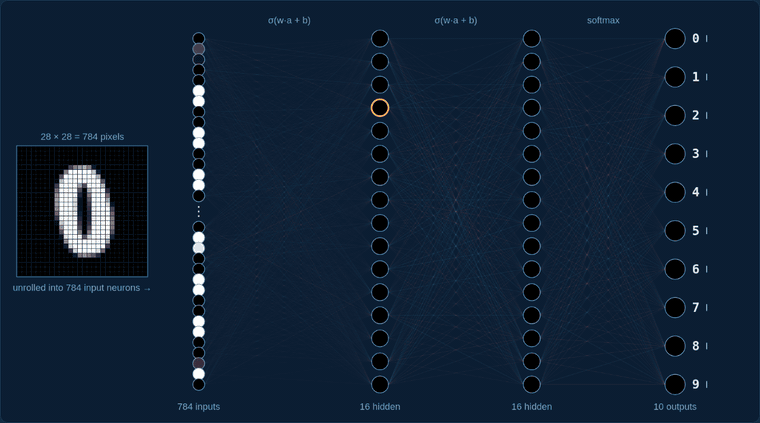

# Side trip &middot; The perceptron, the classic picture

> **The question:** the transformer's blocks each contain a "Multi-Layer Perceptron (MLP)". What *is* a perceptron, and what does a whole layer of them do?

<a href="https://Normansrule.github.io/transparent-transformer-llm/perceptron.html"></a>

<p align="center"><sub>Recorded from <a href="https://Normansrule.github.io/transparent-transformer-llm/perceptron.html">the live page</a>, where you can draw your own digit and click any neuron.</sub></p>

## The idea in one breath

A **perceptron** is the smallest useful piece of a neural network: multiply each input by a weight, add them up, add a bias, and squash the total with a switch.

```
activation = σ( w1·a1 + w2·a2 + ... + w784·a784 + b )          σ(z) = 1 / (1 + e^-z)
```

A **layer** is many perceptrons reading the same inputs with different weights. Stack layers and you get a **multi-layer perceptron**. This one is the famous shape: 784 → 16 → 16 → 10, 13,002 numbers in total.

| layer | neurons | what each one computes | numbers |
|---|:-:|---|:-:|
| input | 784 | the brightness of one pixel | none |
| hidden 1 | 16 | σ(784 weights · pixels + bias) | 12,560 |
| hidden 2 | 16 | σ(16 weights · hidden 1 + bias) | 272 |
| output | 10 | 16 weights · hidden 2 + bias, then softmax | 170 |

## Where it came from

[`train_digits.py`](train_digits.py) builds its own training set, 30,000 digits drawn from the fonts on your computer and randomly rotated, slanted, thickened and squashed, then trains the network with backpropagation written out by hand, exactly like [stage 7](../stages/07_backpropagation/). It scores 99.6% on 2,000 digits it never trained on. Your handwriting is different from fonts, so it will sometimes be fooled: another lesson about training data.

```bash
pip install pillow
python perceptron/train_digits.py          # about a minute; rewrites docs/mlp.js
```

## Three things to look for on the live page

1. **Draw slowly.** The network re-runs after every stroke, so you watch its guess change as the shape forms.
2. **Open the gallery of first-layer neurons.** Each is its 784 weights shown as a picture. They are not tidy strokes and loops; the network found its own messy features that happen to work. The famous video makes the same point.
3. **Click an output neuron.** You see its 16 incoming weights and which hidden neurons pushed it up or down.

## The same thing inside the language model

Every transformer block in this repository has an MLP: 64 inputs → 256 perceptrons → 64 outputs, with a smoother switch (GELU) instead of the sigmoid. On [inside the network](https://Normansrule.github.io/transparent-transformer-llm/network.html), step 7 lights up all 256 for your prompt and names the neuron that fired hardest.

## [Back to the lesson plan &rarr;](../START_HERE.md)
