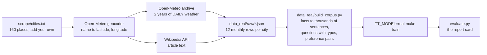

# Field trip &middot; Collect real training data from the web

> **The question:** the lesson model learned from sentences we made up about 32 cities. What happens when you feed the same machine **real data that you collected yourself**?



## Why the first model stumbled

Typed into `chat.py` with the lesson model:

| you typed | it said | why |
|---|---|---|
| What is the current weather in Long Becah | *I but Seattle is usually cloudy and rainy.* | it never saw Long Beach, the word *current*, or a typo |
| Long Beach | *!elcome is usually sunny and warm.* | it never saw a bare city name as a question |
| right now | *Ask me about the weather in Mumbai.* | it never saw a follow-up |

None of that is a bug in the transformer. **A model can only be as good as what it was shown.** So this field trip changes the data, not the architecture:

| | lesson model | real-data model |
|---|---|---|
| cities | 32, climates typed in by hand | 160 (plus yours), climates **measured**: about 730 daily readings each |
| facts per city | 4 | about 40: every month's high and low, rain, snow, hottest and coldest month |
| question styles | 5 | about 25, with lower case, missing punctuation and **spelling mistakes mixed in** |
| follow-ups, off-topic, unknown places | none | included |
| size | 153 thousand parameters | 443 thousand (`small`) or 1 million (`medium`) |

## Do it

```bash
python -m scrape.run --limit 10          # a 2-minute taste: watch real numbers arrive
python -m scrape.run                     # everything, about 25 minutes (it is slow ON PURPOSE, see below)
python data_real/build_corpus.py         # facts -> training text
TT_MODEL=real make train                 # tokenizer, pretraining, SFT, DPO   (about 30 to 60 minutes on a desktop)
TT_MODEL=real python -m transparent_transformer.evaluate     # the report card
TT_MODEL=real python chat.py             # talk to it
```

Add your own town: put a line such as `San Pedro, California, US` at the bottom of [`cities.txt`](cities.txt) and run the first three commands again. Only the new city is downloaded.

Want a stronger model? `TT_PRESET=medium TT_MODEL=real make train` (about a million parameters, roughly three times slower).

Put it on the classroom website: `TT_MODEL=real make web trace`, commit `docs/model_real.js` and `docs/trace_real.js`, and pick *real-data model* in the menu on the site.

## The rules of polite scraping

All three are implemented in [`fetch.py`](fetch.py), which is 60 lines long:

| rule | how | why |
|---|---|---|
| **Say who you are** | a `User-Agent` header naming this project | site owners can contact you instead of blocking you |
| **Go slowly** | a pause between requests (8 seconds for the heavy weather-history calls); wait a minute when the server answers 429 | you are a guest on someone else's computer |
| **Never ask twice** | every response is saved in `data_real/cache/` | re-runs cost the server nothing, and a crash loses nothing |

Two more, which are about choices rather than code:

- **Prefer an official API to scraping web pages.** Both sources here publish one. APIs return clean data, do not break when a page is redesigned, and are what the site owners ask robots to use.
- **Respect the licence and give credit.** Open-Meteo data is CC BY 4.0. Wikipedia text is CC BY-SA 4.0. The scraper writes the credits to `data_real/SOURCES.md` automatically. Keep that file with the data.

## What to look for afterwards

1. **The report card.** `evaluate.py` asks questions whose answers are in `data_real/facts.json` and measures the error in degrees. This is the difference between *it feels smarter* and *it is 4 degrees off on average*.
2. **Generalisation versus memorisation.** Ask about a month and city pair, then check the truth in `data_real/raw/`. When the model is wrong it is usually *plausibly* wrong: a number that fits the season. It has learned the shape of climates, not only a lookup table.
3. **Typos.** Try *Long Becah*. Byte-level tokens (stage 2) mean a misspelled word still becomes tokens, and training on deliberately misspelled questions teaches the model to look past them.
4. **Still no live weather.** It will keep saying *I cannot see live weather data*, because that is true. Live answers need a tool call, as [stage 10](../stages/10_output/) explains.

## Read the code

[`fetch.py`](fetch.py) (politeness) &middot; [`open_meteo.py`](open_meteo.py) (numbers) &middot; [`wikipedia.py`](wikipedia.py) (words) &middot; [`run.py`](run.py) (the loop) &middot; [`../data_real/build_corpus.py`](../data_real/build_corpus.py) (facts to sentences) &middot; [`../tests/test_scrape_offline.py`](../tests/test_scrape_offline.py) (how to test a scraper without the internet)

## [Back to the lesson plan &rarr;](../START_HERE.md)
