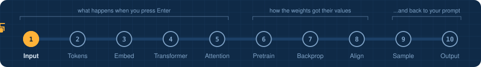

<!-- NAV -->


<p align="center"><a href="../../README.md">&larr; overview</a> &nbsp;&nbsp;&middot;&nbsp;&nbsp; stage 1 of 10 &nbsp;&nbsp;&middot;&nbsp;&nbsp; <a href="../02_tokenizer/"><b>next: tokenizer &rarr;</b></a></p>
<!-- /NAV -->

<!-- DO -->
<p align="center">
<a href="https://Normansrule.github.io/transparent-transformer-llm/#1"></a>
<a href="../../notebooks/01_input.ipynb"></a>
<a href="https://colab.research.google.com/github/Normansrule/transparent-transformer-llm/blob/main/notebooks/01_input.ipynb"></a>
<a href="../../classroom/exercises/ex01.py"></a>
<a href="https://github.com/Normansrule/transparent-transformer-llm/issues/new?template=ask-the-model.yml"></a>
</p>
<!-- /DO -->

<!-- PREDICT -->
> [!IMPORTANT]
> **🎯 Predict before you read.** Your prompt has 35 characters. How many numbers does the computer store for it: fewer, exactly 35, or more?
>
> Hold your answer in your head. You will check it at the bottom of the page.
<!-- /PREDICT -->

# Stage 1 &middot; Input

> **The question:** when you type a prompt and press Enter, what does the computer actually receive?



## The idea in one breath

A computer has never seen a letter. It stores text as a row of whole numbers between 0 and 255 called **bytes**. `W` is 87. A space is 32. `?` is 63. Our prompt, *What is the weather in Los Angeles?*, is 35 of those numbers and nothing else.

| goes in | comes out |
|---|---|
| keys you pressed | `[87, 104, 97, 116, 32, 105, 115, ...]` &nbsp; 35 bytes |

## Why this is not good enough for a model

- **Too long.** One number per letter means long sequences, and the cost of a transformer grows quickly with length.
- **Too meaningless.** `t` tells you almost nothing. ` weather` tells you a lot.

So the next stage groups bytes into bigger, more meaningful pieces.

## Run it

```bash
python stages/01_input/run.py "What is the weather in Los Angeles?"
```

<!-- RUN:01_input -->
<details open>
<summary><b>Real output</b> from the model saved in this repository</summary>

```text
text       : 'What is the weather in Los Angeles?'
characters : 35
bytes      : 35   (UTF-8: plain English letters are 1 byte each, 'é' is 2, an emoji is 4)

char  byte  binary
 'W'    87  01010111
 'h'   104  01101000
 'a'    97  01100001
 't'   116  01110100
 ' '    32  00100000
 'i'   105  01101001
 's'   115  01110011
 ' '    32  00100000
 't'   116  01110100
 'h'   104  01101000
 'e'   101  01100101
 ' '    32  00100000
 ...

That column of numbers is ALL the model will ever get. Next: group them into tokens.
->  python stages/02_tokenizer/run.py
```

</details>
<!-- /RUN -->

> [!TIP]
> Try a prompt with an accent or an emoji, for example `"café ☀"`. You will see some characters take 2 to 4 bytes. This is why models that work on bytes never meet a character they cannot handle.

<!-- QUIZ -->
## Check yourself

*Your prediction from the top of the page: was it right? Now this one.*

**How many numbers does the computer store for the 35-character prompt about Los Angeles?** &nbsp; Click an answer.

<details><summary>A. One number per word, so 7</summary>

> ❌ Not quite. Close this and try another one.

</details>

<details><summary>B. One byte per character, so 35</summary>

> ✅ **Yes.** Plain English letters are one byte each. Words and meaning do not exist yet at this stage.

</details>

<details><summary>C. It stores the meaning, not numbers</summary>

> ❌ Not quite. Close this and try another one.

</details>

**Your turn:** open [`classroom/exercises/ex01.py`](../../classroom/exercises/ex01.py), press the pencil icon to edit it right on GitHub (in your fork), fill in the function and commit; or run `python classroom/check.py` locally. [How the exercises work.](../../START_HERE.md#the-exercises-three-ways)
<!-- /QUIZ -->

---

### The hand-off

We have **35 bytes**. They are correct but clumsy. The carriage now takes them to the tokenizer, which will pack them into **11 tokens**.

## [Continue to stage 2: Tokenization &rarr;](../02_tokenizer/)
