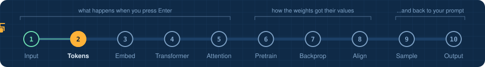
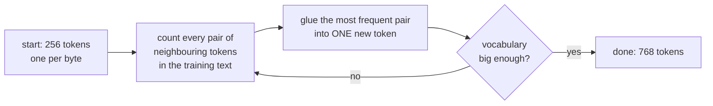

<!-- NAV -->


<p align="center"><a href="../01_input/">&larr; input</a> &nbsp;&nbsp;&middot;&nbsp;&nbsp; stage 2 of 10 &nbsp;&nbsp;&middot;&nbsp;&nbsp; <a href="../03_embedding/"><b>next: embedding &rarr;</b></a></p>
<!-- /NAV -->

<!-- DO -->
<p align="center">
<a href="https://Normansrule.github.io/transparent-transformer-llm/#2"></a>
<a href="../../notebooks/02_tokenizer.ipynb"></a>
<a href="https://colab.research.google.com/github/Normansrule/transparent-transformer-llm/blob/main/notebooks/02_tokenizer.ipynb"></a>
<a href="../../classroom/exercises/ex02.py"></a>
<a href="https://github.com/Normansrule/transparent-transformer-llm/issues/new?template=ask-the-model.yml"></a>
</p>
<!-- /DO -->

<!-- PREDICT -->
> [!IMPORTANT]
> **🎯 Predict before you read.** Which will be split into more pieces: the common word *weather* or the rare word *Reykjavik*? Why?
>
> Hold your answer in your head. You will check it at the bottom of the page.
<!-- /PREDICT -->

# Stage 2 &middot; Tokenization

> **The question:** how do you turn text into a short list of numbers without losing anything?



## The idea in one breath

A **tokenizer** cuts text into pieces called **tokens** and gives every distinct piece an id number. This repository uses **Byte Pair Encoding (BPE)**, the same family of algorithm behind GPT-style, Llama-style and Claude-style models.

## How Byte Pair Encoding (BPE) learns its vocabulary



The first merge it learned from our weather corpus was `' ' + 'i' -> ' i'`. A few hundred merges later it is gluing whole words: `' An' + 'geles' -> ' Angeles'` was merge number 304.

| goes in | comes out |
|---|---|
| `<\|user\|>What is the weather in Los Angeles?<\|assistant\|>` &nbsp; 56 characters | `[765, 87, 362, 262, ...]` &nbsp; 11 token ids |

## Three things worth noticing

1. **The space belongs to the word.** The token is `' weather'`, space included. That is why the pictures show a dot in front of most tokens.
2. **Frequent means short.** Words the tokenizer saw often are one token. A word it never saw, such as *xylophone*, is spelled out in small pieces. Nothing is ever "unknown".
3. **Special tokens are not text.** `<|user|>`, `<|assistant|>` and `<|end|>` are control signals with their own ids. They tell the model who is speaking. The model only learns what they mean in [stage 8](../08_alignment/).

## Run it

```bash
python stages/02_tokenizer/run.py "What is the weather in Los Angeles?"
python stages/02_tokenizer/run.py "A xylophone in Reykjavik"
```

<!-- RUN:02_tokenizer -->
<details open>
<summary><b>Real output</b> from the model saved in this repository</summary>

```text
vocabulary: 256 raw bytes + 509 learned merges + 3 special tokens = 768

the first merges the tokenizer learned (most frequent pairs in data/pretrain.txt):
    1.      ' ' + 'i'      -> ' i'
    2.      ' ' + 'a'      -> ' a'
    3.      'h' + 'e'      -> 'he'
    4.     ' i' + 'n'      -> ' in'
    5.      'n' + 'd'      -> 'nd'
    6.      't' + 'he'     -> 'the'
    7.     ' i' + 's'      -> ' is'
    8.      ' ' + 'w'      -> ' w'
the last ones (by now it is gluing whole words together):
  506.      ' ' + 'U'      -> ' U'
  507.      'B' + 'erlin'  -> 'Berlin'
  508.      'N' + 'o'      -> 'No'
  509.      'T' + 'h'      -> 'Th'

encode('What is the weather in Los Angeles?')
   pieces: ['W', 'hat', ' is', ' the', ' weather', ' in', ' Los', ' Angeles', '?']
   ids   : [87, 362, 262, 270, 279, 259, 598, 559, 63]
   35 characters -> 9 tokens
decode(ids) == original text: True   (tokenization loses nothing)

   ' weather' -> [' weather']
 ' Reykjavik' -> [' Reykjavik']
 ' xylophone' -> [' ', 'x', 'y', 'l', 'op', 'h', 'on', 'e']

common words are ONE token. Rare words shatter into pieces. Words never seen still work, byte by byte.
->  python stages/03_embedding/run.py
```

</details>
<!-- /RUN -->

## Read the code

[`transparent_transformer/tokenizer.py`](../../transparent_transformer/tokenizer.py) is about 150 lines. Start with `train()`, then `_encode_word()`.

> [!NOTE]
> This explains a famous weakness. Ask a large model to count the letter *r* in *strawberry* and it may fail, because it never sees letters. It sees one or two token ids.

<!-- QUIZ -->
## Check yourself

*Your prediction from the top of the page: was it right? Now this one.*

**Why is a rare word like Reykjavik split into several tokens while weather is one token?** &nbsp; Click an answer.

<details><summary>A. Rare words are less important</summary>

> ❌ Not quite. Close this and try another one.

</details>

<details><summary>B. Byte Pair Encoding only glues together pairs it saw OFTEN in its training text</summary>

> ✅ **Yes.** Merges are learned by frequency. Frequent strings earn their own token. Rare ones are spelled from smaller pieces.

</details>

<details><summary>C. Long words are always split</summary>

> ❌ Not quite. Close this and try another one.

</details>

**Your turn:** open [`classroom/exercises/ex02.py`](../../classroom/exercises/ex02.py), press the pencil icon to edit it right on GitHub (in your fork), fill in the function and commit; or run `python classroom/check.py` locally. [How the exercises work.](../../START_HERE.md#the-exercises-three-ways)
<!-- /QUIZ -->

---

### The hand-off

We have **11 integers**. But id 559 (` Angeles`) is not "bigger" or "better" than id 558. The ids are name tags with no meaning attached. The next stage gives each one a meaning the network can do arithmetic with.

## [Continue to stage 3: Embedding &rarr;](../03_embedding/)
