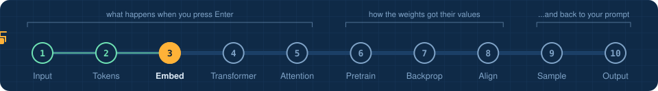

<!-- NAV -->


<p align="center"><a href="../02_tokenizer/">&larr; tokenizer</a> &nbsp;&nbsp;&middot;&nbsp;&nbsp; stage 3 of 10 &nbsp;&nbsp;&middot;&nbsp;&nbsp; <a href="../04_transformer/"><b>next: transformer &rarr;</b></a></p>
<!-- /NAV -->

<!-- DO -->
<p align="center">
<a href="https://Normansrule.github.io/transparent-transformer-llm/#3"></a>
<a href="../../notebooks/03_embedding.ipynb"></a>
<a href="https://colab.research.google.com/github/Normansrule/transparent-transformer-llm/blob/main/notebooks/03_embedding.ipynb"></a>
<a href="../../classroom/exercises/ex03.py"></a>
<a href="https://github.com/Normansrule/transparent-transformer-llm/issues/new?template=ask-the-model.yml"></a>
</p>
<!-- /DO -->

<!-- PREDICT -->
> [!IMPORTANT]
> **🎯 Predict before you read.** If you swapped the vectors for the words *sunny* and *cold*, would the model notice? What does that tell you about where meaning lives?
>
> Hold your answer in your head. You will check it at the bottom of the page.
<!-- /PREDICT -->

# Stage 3 &middot; Embedding

> **The question:** how can a plain id number carry meaning?



## The idea in one breath

The model owns a table with one row per token: 768 rows, 64 numbers per row. **Embedding is a table lookup.** Token id 559 (` Angeles`) becomes row 559. That row of 64 numbers is called the token's **vector**, and from here on the model only ever works with vectors.

```
vector = token_table[id]  +  position_table[where the token sits]
```

| goes in | comes out |
|---|---|
| 11 integers, shape `(11,)` | 11 vectors of 64 numbers, shape `(11, 64)` |

## Why add a position vector?

The attention mechanism in stage 5 looks at all tokens at once, like a bag. Without position information, *dog bites man* and *man bites dog* would be the same bag. So a second learned table adds "I am token number 1", "I am token number 2", and so on.

## Where do the numbers come from?

They start random. Nobody designs them. During [pretraining](../06_pretraining/) they are nudged, a tiny bit per step, until they are useful for predicting the next token. A side effect: tokens that are used in similar ways drift toward similar vectors. The script below checks this on our trained model by asking which tokens are nearest to ` sunny` and ` cold`.

## Run it

```bash
python stages/03_embedding/run.py
```

<!-- RUN:03_embedding -->
<details open>
<summary><b>Real output</b> from the model saved in this repository</summary>

```text
embedding table : (768, 64)  = (vocab_size, d_model)   49,152 learned numbers
input           : (9,) integers
output          : (9, 64) floats

          'W' (id  87) -> [+0.04 +0.07 -0.23 -0.03 +0.16 +0.08 +0.27 -0.13 ...]
        'hat' (id 362) -> [-0.07 -0.12 -0.24 +0.19 +0.00 -0.06 -0.02 -0.11 ...]
        ' is' (id 262) -> [-0.17 -0.09 -0.04 +0.20 +0.26 -0.13 -0.08 +0.15 ...]
       ' the' (id 270) -> [-0.17 -0.01 -0.25 +0.04 -0.06 -0.17 -0.21 +0.30 ...]

Nobody told the model what words mean. After training, tokens used in similar
places have ended up with similar vectors. Nearest neighbours by cosine similarity:

     ' sunny' ~ ' stormy' (0.46), ' cloudy' (0.46), ' dry' (0.41), ' rainy' (0.40), ' windy' (0.38)
      ' cold' ~ ' cool' (0.50), ' hot' (0.44), ' cloudy' (0.38), ' warm' (0.35), ' very' (0.34)
    ' winter' ~ ' summer' (0.43), ' People' (0.39), ' degrees' (0.34), ' California' (0.32), ' often' (0.30)
     ' Tokyo' ~ ' Beijing' (0.57), ' Madrid' (0.57), ' Toronto' (0.56), ' Miami' (0.55), ' Boston' (0.55)
        ' is' ~ ' from' (0.30), ' often' (0.28), ' nice' (0.27), ' very' (0.26), ' usually' (0.24)

->  python stages/04_transformer/run.py
```

</details>
<!-- /RUN -->

## Read the code

[`transparent_transformer/embedding.py`](../../transparent_transformer/embedding.py). The forward pass is two lines. The backward pass shows a neat fact: only the rows that were looked up receive any gradient.

<!-- QUIZ -->
## Check yourself

*Your prediction from the top of the page: was it right? Now this one.*

**What is an embedding, mechanically?** &nbsp; Click an answer.

<details><summary>A. A row looked up in a learned table</summary>

> ✅ **Yes.** Token id 559 simply selects row 559 of a 768 by 64 table. Training decides what the numbers are.

</details>

<details><summary>B. A dictionary definition of the word</summary>

> ❌ Not quite. Close this and try another one.

</details>

<details><summary>C. A compressed copy of the text</summary>

> ❌ Not quite. Close this and try another one.

</details>

**Your turn:** open [`classroom/exercises/ex03.py`](../../classroom/exercises/ex03.py), press the pencil icon to edit it right on GitHub (in your fork), fill in the function and commit; or run `python classroom/check.py` locally. [How the exercises work.](../../START_HERE.md#the-exercises-three-ways)
<!-- /QUIZ -->

---

### The hand-off

We have an **11 by 64 grid of numbers** called the **residual stream**. Each row knows what its token is and where it sits, but nothing about its neighbours. ` Angeles` does not yet know it follows ` Los`. Fixing that is the job of the transformer.

## [Continue to stage 4: The transformer &rarr;](../04_transformer/)
