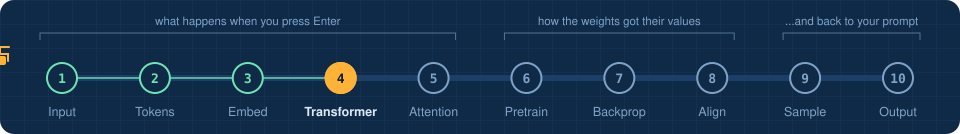
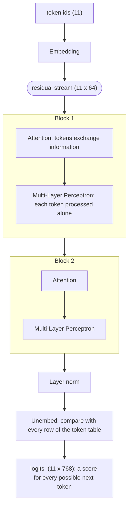

<!-- NAV -->


<p align="center"><a href="../03_embedding/">&larr; embedding</a> &nbsp;&nbsp;&middot;&nbsp;&nbsp; stage 4 of 10 &nbsp;&nbsp;&middot;&nbsp;&nbsp; <a href="../05_attention_closeup/"><b>next: attention closeup &rarr;</b></a></p>
<!-- /NAV -->

<!-- DO -->
<p align="center">
<a href="https://Normansrule.github.io/transparent-transformer-llm/#4"></a>
<a href="../../notebooks/04_transformer.ipynb"></a>
<a href="https://colab.research.google.com/github/Normansrule/transparent-transformer-llm/blob/main/notebooks/04_transformer.ipynb"></a>
<a href="../../classroom/exercises/ex04.py"></a>
<a href="https://github.com/Normansrule/transparent-transformer-llm/issues/new?template=ask-the-model.yml"></a>
</p>
<!-- /DO -->

<!-- PREDICT -->
> [!IMPORTANT]
> **🎯 Predict before you read.** The transformer has 153,344 numbers. Guess: which part holds the most, the embedding table, attention, or the Multi-Layer Perceptron (MLP)?
>
> Hold your answer in your head. You will check it at the bottom of the page.
<!-- /PREDICT -->

# Stage 4 &middot; The transformer

> **The question:** what is the big machine in the middle, seen from far away?



## The idea in one breath

A transformer is a **stack of identical blocks**. The grid of vectors from stage 3 flows through them along one shared channel, the **residual stream**. Every block reads the stream, works something out, and **adds** its result back. It never overwrites.



| goes in | comes out |
|---|---|
| vectors, shape `(11, 64)` | **logits**, shape `(11, 768)`: one score per vocabulary entry, at every position |

## Watching it think, layer by layer

Nothing says the prediction has to be read only at the end. The **logit lens** applies the final read-out to the stream after *every* block and asks: what would the model say if it stopped here?



The embedding alone knows nothing useful. One block later the answer is nearly settled. This trick, and the residual-stream view it depends on, is a working tool in interpretability research, not just a teaching aid. On the [live site](https://Normansrule.github.io/transparent-transformer-llm/#4) you can run it on your own prompt and also watch the last token's 64 numbers change colour as they pass through.

## The two halves of a block

| part | what it does | analogy |
|---|---|---|
| **Attention** | moves information *between* tokens | a meeting: everyone hears from the relevant colleagues |
| **Multi-Layer Perceptron (MLP)** | transforms each token *on its own*; stores much of the model's knowledge | going back to your desk to think about what you heard |

Both are wrapped the same way: `x = x + part(layer_norm(x))`. That plus sign is the **residual connection**. It is the reason very deep models can be trained at all, because in [stage 7](../07_backpropagation/) it gives gradients a clear road back to the early layers.

## This model versus a frontier model

| | transparent_transformer | a large production model |
|---|---|---|
| parameters | about 150 thousand | hundreds of billions |
| blocks | 2 | 80 or more |
| vector width | 64 | 8,000 or more |
| vocabulary | 768 | 100,000 or more |
| training text | 190 thousand characters | trillions of tokens |
| **architecture** | **the same** | **the same** |

## Run it

```bash
python stages/04_transformer/run.py
```

<!-- RUN:04_transformer -->
<details open>
<summary><b>Real output</b> from the model saved in this repository</summary>

```text
WHERE THE PARAMETERS LIVE
   embedding (token + position tables)              53,248  #############
   layer norms                                         640  
   attention (Q, K, V and output projections)       33,280  ########
   MLP (Multi-Layer Perceptron)                     66,176  #################
   total                                           153,344

THE FORWARD PASS  (B = batch, T = tokens, d = d_model, V = vocab_size)
   token ids                     (1, 11)            (B, T)
   after embedding               (1, 11, 64)        (B, T, d)
   block 1: attention weights    (1, 4, 11, 11)     (B, heads, T, T)
   block 1: stream after block   (1, 11, 64)        (B, T, d)   <- same shape in, same shape out
   block 2: attention weights    (1, 4, 11, 11)     (B, heads, T, T)
   block 2: stream after block   (1, 11, 64)        (B, T, d)   <- same shape in, same shape out
   logits                        (1, 11, 768)       (B, T, V)   one score per vocabulary entry, per position

the 5 highest-scoring next tokens after the prompt:
         ' I'  logit +16.07
         ' R'  logit +11.48
       ' the'  logit +7.72
        ' in'  logit +6.22
         ' m'  logit +5.05

Logits are raw scores, not probabilities yet. Stage 9 handles that.
->  python stages/05_attention_closeup/run.py
```

</details>
<!-- /RUN -->

## Read the code

[`transparent_transformer/transformer.py`](../../transparent_transformer/transformer.py). `Block.forward` is four lines. `GPT.forward` is the whole diagram above in about ten.

<!-- QUIZ -->
## Check yourself

*Your prediction from the top of the page: was it right? Now this one.*

**What does each block do to the residual stream?** &nbsp; Click an answer.

<details><summary>A. Replaces it with a new one</summary>

> ❌ Not quite. Close this and try another one.

</details>

<details><summary>B. Adds a correction to it</summary>

> ✅ **Yes.** x = x + block(x). Blocks only add. That is what lets gradients flow back through deep stacks.

</details>

<details><summary>C. Deletes unimportant tokens</summary>

> ❌ Not quite. Close this and try another one.

</details>

**Your turn:** open [`classroom/exercises/ex04.py`](../../classroom/exercises/ex04.py), press the pencil icon to edit it right on GitHub (in your fork), fill in the function and commit; or run `python classroom/check.py` locally. [How the exercises work.](../../START_HERE.md#the-exercises-three-ways)
<!-- /QUIZ -->

---

### The hand-off

That was the view from the air. Now we zoom into a single block and watch the last token, `<|assistant|>`, reach back and read ` Angeles`.

## [Continue to stage 5: Attention close-up &rarr;](../05_attention_closeup/)
