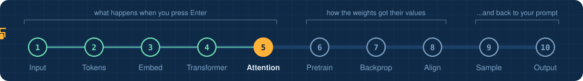
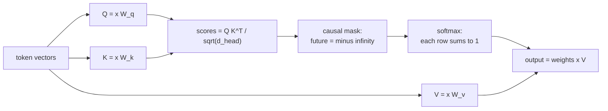

<!-- NAV -->


<p align="center"><a href="../04_transformer/">&larr; transformer</a> &nbsp;&nbsp;&middot;&nbsp;&nbsp; stage 5 of 10 &nbsp;&nbsp;&middot;&nbsp;&nbsp; <a href="../06_pretraining/"><b>next: pretraining &rarr;</b></a></p>
<!-- /NAV -->

<!-- DO -->
<p align="center">
<a href="https://Normansrule.github.io/transparent-transformer-llm/#5"></a>
<a href="../../notebooks/05_attention_closeup.ipynb"></a>
<a href="https://colab.research.google.com/github/Normansrule/transparent-transformer-llm/blob/main/notebooks/05_attention_closeup.ipynb"></a>
<a href="../../classroom/exercises/ex05.py"></a>
<a href="https://github.com/Normansrule/transparent-transformer-llm/issues/new?template=ask-the-model.yml"></a>
</p>
<!-- /DO -->

<!-- PREDICT -->
> [!IMPORTANT]
> **🎯 Predict before you read.** The last token has to start the answer. Which earlier word do you think it will look at hardest: *weather*, *Los*, *Angeles*, or *?*
>
> Hold your answer in your head. You will check it at the bottom of the page.
<!-- /PREDICT -->

# Stage 5 &middot; Close-up: attention

> **The question:** how does one token find out what the other tokens are?



## The idea in one breath

Every token makes three small vectors from its own vector:

| name | plain meaning |
|---|---|
| **Query (Q)** | "what am I looking for?" |
| **Key (K)** | "this is what I contain" |
| **Value (V)** | "this is what I will hand over if you pick me" |

A token compares its query with the key of every token **before it**. High match means high attention weight. It then collects a blend of their values, weighted by those scores. That blend is what gets added to the residual stream.



## The causal mask, or why the model cannot cheat

When generating, the future does not exist yet. So during training the model is forbidden from looking ahead as well: every score for a later token is set to minus infinity before the softmax, which makes its weight exactly zero. In the heat map printed below, that is the empty upper-right triangle. [`tests/test_gradients.py`](../../tests/test_gradients.py) proves that changing a later token never changes an earlier prediction.

## All eight heads at once



This is the picture you will see in research papers: one small matrix per head, rows looking, columns looked at. Two things jump out. Every matrix is a triangle, which is the causal mask made visible. And the heads are not copies of each other: some track the diagonal, some fixate on one token, one has found the city.

## What the heads learned here

In the model shipped here, **block 1, head 1** sends 88% of the final token's attention to ` weather`, and **block 1, head 3** sends about half of its attention to ` Angeles`. Between them they have picked out the topic and the city, which is exactly what the answer needs. Nobody programmed that. Gradient descent found it because it lowers the loss. (If you retrain, the jobs may land on different heads.)

"Multi-head" means this whole mechanism runs four times in parallel on thinner slices of the vector, so different heads can specialise.

## Run it

This script recomputes one head **by hand in six lines of NumPy** and checks the result against the model.

```bash
python stages/05_attention_closeup/run.py
```

<!-- RUN:05_attention_closeup -->
<details open>
<summary><b>Real output</b> from the model saved in this repository</summary>

```text
recomputed block 1 / head 1 by hand. It matches the model exactly.

rows = the token doing the looking, columns = the token being looked at
the empty upper-right triangle is the causal mask: no token can see the future

        <|user|> |██
               W |░░▓▓
             hat |▒▒░░  
              is |    ██  
             the |░░░░░░    
         weather |▒▒  ▒▒      
              in |░░  ▓▓        
             Los |  ░░            
         Angeles |        ▒▒  ░░    
               ? |                    
    <|assistant| |          ██          

what the final token reads from, per head (it is about to write the answer):
   block 1 head 1: ' weather' 88%   ' the' 6%   ' in' 3%
   block 1 head 2: '<|assistant|>' 16%   '<|user|>' 12%   'W' 12%
   block 1 head 3: ' Angeles' 46%   'W' 27%   'hat' 8%
   block 1 head 4: '?' 27%   ' is' 25%   ' the' 17%
   block 2 head 1: ' the' 16%   'hat' 13%   '?' 13%
   block 2 head 2: ' weather' 19%   ' the' 17%   ' is' 15%
   block 2 head 3: '?' 57%   'W' 19%   ' Los' 6%
   block 2 head 4: ' weather' 27%   '<|user|>' 14%   ' the' 11%

->  python stages/06_pretraining/run.py
```

</details>
<!-- /RUN -->

## Read the code

[`transparent_transformer/attention.py`](../../transparent_transformer/attention.py) for attention, [`transparent_transformer/layers.py`](../../transparent_transformer/layers.py) for the Multi-Layer Perceptron (MLP), layer norm and the Gaussian Error Linear Unit (GELU) activation.

<!-- QUIZ -->
## Check yourself

*Your prediction from the top of the page: was it right? Now this one.*

**Why can a token only attend to tokens before it?** &nbsp; Click an answer.

<details><summary>A. Earlier tokens are more important</summary>

> ❌ Not quite. Close this and try another one.

</details>

<details><summary>B. To save memory</summary>

> ❌ Not quite. Close this and try another one.

</details>

<details><summary>C. When generating, later tokens do not exist yet, so training must not rely on them</summary>

> ✅ **Yes.** The causal mask makes training match generation. Otherwise the model would learn to cheat by peeking.

</details>

**Your turn:** open [`classroom/exercises/ex05.py`](../../classroom/exercises/ex05.py), press the pencil icon to edit it right on GitHub (in your fork), fill in the function and commit; or run `python classroom/check.py` locally. [How the exercises work.](../../START_HERE.md#the-exercises-three-ways)
<!-- /QUIZ -->

---

### The hand-off

You have now seen every moving part of the forward pass. But we skipped the most important question: **who set those 150 thousand numbers so that a head looks at ` Angeles`?** Nobody did. The carriage now leaves the main line and enters the workshop, where the weights are made.

## [Continue to stage 6: Pretraining &rarr;](../06_pretraining/)
