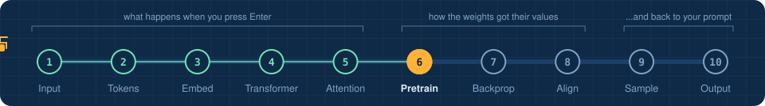
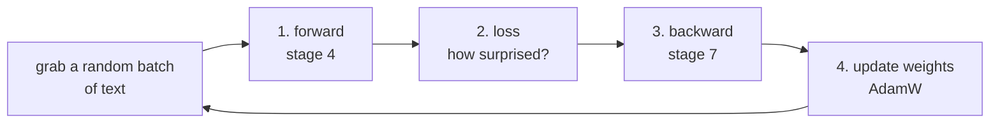

<!-- NAV -->


<p align="center"><a href="../05_attention_closeup/">&larr; attention closeup</a> &nbsp;&nbsp;&middot;&nbsp;&nbsp; stage 6 of 10 &nbsp;&nbsp;&middot;&nbsp;&nbsp; <a href="../07_backpropagation/"><b>next: backpropagation &rarr;</b></a></p>
<!-- /NAV -->

<!-- DO -->
<p align="center">
<a href="https://Normansrule.github.io/transparent-transformer-llm/#6"></a>
<a href="../../notebooks/06_pretraining.ipynb"></a>
<a href="https://colab.research.google.com/github/Normansrule/transparent-transformer-llm/blob/main/notebooks/06_pretraining.ipynb"></a>
<a href="../../classroom/exercises/ex06.py"></a>
<a href="https://github.com/Normansrule/transparent-transformer-llm/issues/new?template=ask-the-model.yml"></a>
</p>
<!-- /DO -->

<!-- PREDICT -->
> [!IMPORTANT]
> **🎯 Predict before you read.** Nobody wrote 'Los Angeles is sunny' as a labelled fact. How could a model learn it just by guessing the next word?
>
> Hold your answer in your head. You will check it at the bottom of the page.
<!-- /PREDICT -->

# Stage 6 &middot; Pretraining

> **The question:** where does a model's knowledge come from?



## The idea in one breath

One game, played over and over: **here is some real text, guess the next token.**

```
the model sees :  The  weather  in  Los  Angeles  is  usually
it must predict:  weather  in  Los  Angeles  is  usually  sunny
                  (the same text, shifted left by one token)
```

There are no labels and no human teachers. The text is its own answer key. Yet to guess ` sunny` after *Los Angeles is usually*, the model has no choice but to store a fact about Los Angeles somewhere in its weights. Scale that up to a large slice of the internet and you get a model that has absorbed grammar, facts, styles and reasoning patterns, all as a side effect of next-token prediction.

## The loss: one number for "how wrong was that?"

`loss = -log(probability the model gave to the correct token)`

| the model gave the right token | loss |
|---|---|
| 100% | 0.00 |
| 50% | 0.69 |
| 1% | 4.61 |
| 1 in 768, a blind guess | **6.64** &larr; where training starts |

The curve above is the real training run of the model in this repository. The text on the right of the picture is what the model wrote at each checkpoint when asked to continue *The weather in Los Angeles is*.

## The training loop



## Run it

See the game being played by an untrained model and by the trained one:

```bash
python stages/06_pretraining/run.py
```

<!-- RUN:06_pretraining -->
<details open>
<summary><b>Real output</b> from the model saved in this repository</summary>

```text
ONE TRAINING EXAMPLE = a piece of text and the same text shifted by one

   the model sees                    it must predict    untrained   trained
   'The'                             ' weather'              0.2%      1.7%
   'The weather'                     ' in'                   0.2%      0.6%
   'The weather in'                  ' Los'                  0.1%      0.0%
   'The weather in Los'              ' Angeles'              0.1%     99.8%
   '... weather in Los Angeles'      ' is'                   0.1%     99.8%
   '... in Los Angeles is'           ' usually'              0.1%     99.7%
   '... Los Angeles is usually'      ' sunny'                0.1%     98.5%
   '... Angeles is usually sunny'    ' and'                  0.1%    100.0%
   '... is usually sunny and'        ' warm'                 0.1%     99.9%
   '... usually sunny and warm'      '.'                     0.2%    100.0%

   (the two right-hand columns: probability each model gave to the CORRECT next token)

   untrained loss: 6.61    (ln(768) = 6.64 is pure guessing)
   trained loss  : 1.76

Look at ' sunny': the model had to learn a FACT about Los Angeles to win that round.
->  python stages/07_backpropagation/run.py
```

</details>
<!-- /RUN -->

Train the base model yourself. It takes about three minutes on one Central Processing Unit (CPU) core:

```bash
python -m transparent_transformer.pretrain
```

> [!TIP]
> **Field trip.** This model learned from made-up sentences. [`scrape/`](../../scrape/) shows how to collect real data from the web, retrain on it, and measure the difference.

## Read the code

[`transparent_transformer/pretrain.py`](../../transparent_transformer/pretrain.py) for the loop, [`transparent_transformer/loss.py`](../../transparent_transformer/loss.py) for cross-entropy, [`data/make_corpus.py`](../../data/make_corpus.py) to see every sentence the model was ever shown.

> [!IMPORTANT]
> The result of this stage is a **base model**. It is a text continuer, not an assistant. Ask it a question and it carries on writing weather documents. Stage 8 deals with that.

<!-- QUIZ -->
## Check yourself

*Your prediction from the top of the page: was it right? Now this one.*

**What labels does pretraining need?** &nbsp; Click an answer.

<details><summary>A. None: the next token in real text is the answer key</summary>

> ✅ **Yes.** Next-token prediction is self-supervised. That is why it scales to enormous amounts of text.

</details>

<details><summary>B. Humans label each sentence</summary>

> ❌ Not quite. Close this and try another one.

</details>

<details><summary>C. Correct answers to questions</summary>

> ❌ Not quite. Close this and try another one.

</details>

**Your turn:** open [`classroom/exercises/ex06.py`](../../classroom/exercises/ex06.py), press the pencil icon to edit it right on GitHub (in your fork), fill in the function and commit; or run `python classroom/check.py` locally. [How the exercises work.](../../START_HERE.md#the-exercises-three-ways)
<!-- /QUIZ -->

---

### The hand-off

Step 3 of that loop, "backward", was a single arrow in the diagram. It is the engine of all deep learning, so it gets its own stage.

## [Continue to stage 7: Backpropagation &rarr;](../07_backpropagation/)
