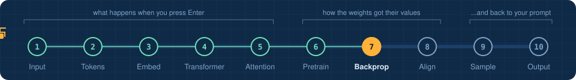
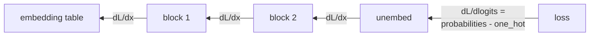

<!-- NAV -->


<p align="center"><a href="../06_pretraining/">&larr; pretraining</a> &nbsp;&nbsp;&middot;&nbsp;&nbsp; stage 7 of 10 &nbsp;&nbsp;&middot;&nbsp;&nbsp; <a href="../08_alignment/"><b>next: alignment &rarr;</b></a></p>
<!-- /NAV -->

<!-- DO -->
<p align="center">
<a href="https://Normansrule.github.io/transparent-transformer-llm/#7"></a>
<a href="../../notebooks/07_backpropagation.ipynb"></a>
<a href="https://colab.research.google.com/github/Normansrule/transparent-transformer-llm/blob/main/notebooks/07_backpropagation.ipynb"></a>
<a href="../../classroom/exercises/ex07.py"></a>
<a href="https://github.com/Normansrule/transparent-transformer-llm/issues/new?template=ask-the-model.yml"></a>
</p>
<!-- /DO -->

<!-- PREDICT -->
> [!IMPORTANT]
> **🎯 Predict before you read.** Suppose you wanted to know how each of the 153,344 weights affects the loss. How many times would you have to run the model if you tested them one at a time?
>
> Hold your answer in your head. You will check it at the bottom of the page.
<!-- /PREDICT -->

# Stage 7 &middot; Backpropagation

> **The question:** the model made a bad guess. Which of its 150 thousand weights are to blame, and by how much?



## The idea in one breath

For every weight `w`, we want one number: **if `w` were a tiny bit larger, how much would the loss change?** That number is the **gradient**, written `dLoss/dw`. Once we have it, learning is a one-liner:

```
w = w - learning_rate * dLoss/dw
```

## How to get 150 thousand gradients cheaply

The slow way: wiggle one weight, rerun the model, see what the loss did. Two forward passes per weight. Hopeless.

The fast way is **backpropagation**, which is the chain rule from calculus applied in reverse order:

1. The loss hands the last layer a message: *"this is how the loss changes when your **output** changes."*
2. That layer uses the message to compute the gradient of its **own weights**, and
3. passes a new message to the layer before it: *"this is how the loss changes when your **output**, which was my input, changes."*
4. Repeat until you reach the embedding table.

One backward pass, about the cost of two forward passes, gives **every** gradient at once.



## No magic in this repository

Frameworks such as PyTorch do this automatically ("autograd"), which is wonderful for research and terrible for understanding. Here every layer has a hand-written `backward()` directly under its `forward()`:

| layer | forward | backward (what it sends upstream) |
|---|---|---|
| Linear | `y = x W + b` | `dx = dy W^T` &nbsp; and &nbsp; `dW = x^T dy` |
| residual `+` | `y = x + f(x)` | the gradient is **copied** to both branches |
| softmax + cross-entropy | probabilities, then `-log p` | `probabilities - one_hot(correct)` |
| embedding lookup | pick rows | only the picked rows get gradient |

[`tests/test_gradients.py`](../../tests/test_gradients.py) compares these formulas against the slow wiggle method. They agree to about seven decimal places.

## Run it

One training step in slow motion, including the wiggle check:

```bash
python stages/07_backpropagation/run.py
pytest -q          # the proof that all the hand-written calculus is right
```

<!-- RUN:07_backpropagation -->
<details open>
<summary><b>Real output</b> from the model saved in this repository</summary>

```text
1. FORWARD   run the sentence through the model
             loss = 6.6120

2. BACKWARD  start from dLoss/dlogits = probabilities - one_hot(correct), walk back layer by layer
             weight matrix         shape         size of its gradient
             ln_f.g                (64,)         0.0491
             block1.mlp.down.W     (256, 64)     1.9421
             block1.attn.qkv.W     (64, 192)     0.5292
             block0.mlp.down.W     (256, 64)     2.0766
             block0.attn.qkv.W     (64, 192)     0.5947
             embed.tok             (768, 64)     3.1129

3. CHECK     is the hand-written calculus right? Wiggle ONE weight and measure the loss directly
             wiggle estimate  (loss(w+h) - loss(w-h)) / 2h = -0.010611
             backpropagation                                = -0.010610
             same answer. Backprop gets ALL 100,000+ gradients from one backward pass;
             wiggling would need two forward passes PER WEIGHT.

4. UPDATE    w = w - learning_rate * gradient, for every weight
             loss before 6.6120  ->  after 5.0352

That drop is learning. Pretraining is this step, repeated 1,500 times on different text.
->  python stages/08_alignment/run.py
```

</details>
<!-- /RUN -->

## Read the code

Every `backward()` in [`transparent_transformer/layers.py`](../../transparent_transformer/layers.py), [`transparent_transformer/attention.py`](../../transparent_transformer/attention.py) and [`transparent_transformer/transformer.py`](../../transparent_transformer/transformer.py). The optimizer that applies the gradients is [`transparent_transformer/optimizer.py`](../../transparent_transformer/optimizer.py).

<!-- QUIZ -->
## Check yourself

*Your prediction from the top of the page: was it right? Now this one.*

**Why use backpropagation instead of wiggling each weight to see what happens?** &nbsp; Click an answer.

<details><summary>A. Wiggling gives wrong answers</summary>

> ❌ Not quite. Close this and try another one.

</details>

<details><summary>B. One backward pass yields every gradient; wiggling needs two forward passes per weight</summary>

> ✅ **Yes.** Both give the same numbers. The tests in this repository check exactly that. Backpropagation is just vastly cheaper.

</details>

<details><summary>C. Backpropagation needs no calculus</summary>

> ❌ Not quite. Close this and try another one.

</details>

**Your turn:** open [`classroom/exercises/ex07.py`](../../classroom/exercises/ex07.py), press the pencil icon to edit it right on GitHub (in your fork), fill in the function and commit; or run `python classroom/check.py` locally. [How the exercises work.](../../START_HERE.md#the-exercises-three-ways)
<!-- /QUIZ -->

---

### The hand-off

Forward, loss, backward, update, 1,500 times: that produced a base model that knows Los Angeles is sunny. It still will not answer a question. One more visit to the workshop.

## [Continue to stage 8: Alignment &rarr;](../08_alignment/)
