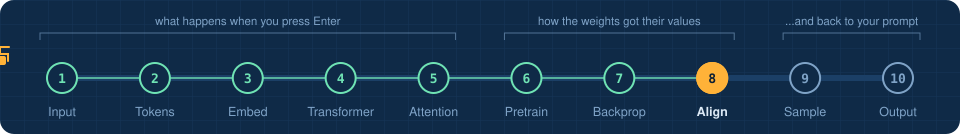
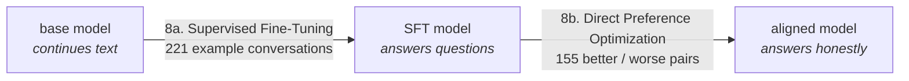

<!-- NAV -->


<p align="center"><a href="../07_backpropagation/">&larr; backpropagation</a> &nbsp;&nbsp;&middot;&nbsp;&nbsp; stage 8 of 10 &nbsp;&nbsp;&middot;&nbsp;&nbsp; <a href="../09_sampling/"><b>next: sampling &rarr;</b></a></p>
<!-- /NAV -->

<!-- DO -->
<p align="center">
<a href="https://Normansrule.github.io/transparent-transformer-llm/#8"></a>
<a href="../../notebooks/08_alignment.ipynb"></a>
<a href="https://colab.research.google.com/github/Normansrule/transparent-transformer-llm/blob/main/notebooks/08_alignment.ipynb"></a>
<a href="../../classroom/exercises/ex08.py"></a>
<a href="https://github.com/Normansrule/transparent-transformer-llm/issues/new?template=ask-the-model.yml"></a>
</p>
<!-- /DO -->

<!-- PREDICT -->
> [!IMPORTANT]
> **🎯 Predict before you read.** Same weights, same code. What could possibly change a model that rambles into one that answers?
>
> Hold your answer in your head. You will check it at the bottom of the page.
<!-- /PREDICT -->

# Stage 8 &middot; Alignment

> **The question:** the base model knows things. Why does it not answer? And how do you change what a model *does* without retraining what it *knows*?



## The idea in one breath

A base model continues documents. **Alignment** is a second, much smaller round of training that teaches it a role: *you are the assistant, the user asked something, answer helpfully and honestly, then stop.* It uses exactly the same machinery as stages 6 and 7. Only the data and the loss change.



## 8a. Supervised Fine-Tuning (SFT)

Conversations are written in a fixed **chat template**, and the next-token game is played again with one twist, the **loss mask**: the model is graded only on the assistant's tokens.

```
<|user|>What is the weather in Los Angeles?<|assistant|> It is 75 degrees ...<|end|>
\________________ mask = 0: not graded ______________/\______ mask = 1: graded ______/
```

After about 30 seconds of this the model has learned the format, and learned to emit `<|end|>` so that generation stops.

**The catch, on purpose:** half of our SFT answers are bad. They claim to know the live temperature (*"It is 75 degrees and sunny right now"*), which a language model cannot know. Real fine-tuning data is imperfect too. The SFT model faithfully copies both styles.

## 8b. Direct Preference Optimization (DPO)

Now we show the model **pairs** of answers to the same prompt:

| | answer |
|---|---|
| chosen | *I cannot see live weather data, but Los Angeles is usually sunny and warm.* |
| rejected | *It is 75 degrees and sunny in Los Angeles right now.* |

The loss rewards the model for making the chosen answer **more likely than it used to be**, relative to the rejected one. "Used to be" is measured against a frozen copy of the SFT model, which acts as an anchor so the model does not wander off and forget how to write:

```
z    = beta * [ (logp(chosen) - logp(rejected))  -  (same thing, frozen reference model) ]
loss = -log(sigmoid(z))
```

Direct Preference Optimization (DPO) is a simpler relative of Reinforcement Learning from Human Feedback (RLHF). It reaches a similar goal without training a separate reward model.

## Run it

```bash
python stages/08_alignment/run.py "What is the weather in Los Angeles?"
```

<!-- RUN:08_alignment -->
<details open>
<summary><b>Real output</b> from the model saved in this repository</summary>

```text
prompt: 'What is the weather in Los Angeles?'

   base  (pretraining only)                'the next few days.\nSeattle is usually cloudy and rainy. A normal day in Seattle is about 55 degrees.\nIf you visit Seoul in South Korea, expect mild and clear days. Many people there hike in the hills.\nThe weather changes from'
   + SFT (Supervised Fine-Tuning)          'Right now it is 75 degrees and sunny in Los Angeles.'
   + DPO (Direct Preference Optimization)  'I cannot see live weather data, but Los Angeles is usually sunny and warm.'

THE LOSS MASK: during SFT only the answer is graded (1), never the question (0)

   <|user|> W hat  is  the  weather  in  Los  Angeles ? <|assistant|>  I  cannot  see  live  weather  data . <|end|>
   0 0 0 0 0 0 0 0 0 0 0 1 1 1 1 1 1 1 1 

->  python stages/09_sampling/run.py
```

</details>
<!-- /RUN -->

Redo the alignment yourself, about one minute in total:

```bash
python -m transparent_transformer.alignment sft
python -m transparent_transformer.alignment dpo
```

## Two experiments that teach more than the happy path

> [!WARNING]
> **Break it.** Run `python -m transparent_transformer.alignment dpo --lr 2e-4`. The preference margin explodes and the model starts producing word salad. That is *over-optimization*: push too hard on a preference signal and the model forgets how to write. The frozen reference and a small learning rate are what prevent it. Run the plain command again afterwards to restore the good model.

> [!NOTE]
> **Ask about Lisbon.** Lisbon appears in the pretraining text but was deliberately left out of all alignment data. Try `python stages/08_alignment/run.py "What is the weather in Lisbon?"`. A model this small often answers about *London* instead. It has learned the honest answer *pattern* and fills the slot with a familiar city that starts the same way. That is a small, fully inspectable example of a **hallucination**: fluent, confident, well-formatted and wrong.

## Read the code

[`transparent_transformer/alignment.py`](../../transparent_transformer/alignment.py). The Direct Preference Optimization (DPO) gradient is derived by hand in the comments, line by line.

<!-- QUIZ -->
## Check yourself

*Your prediction from the top of the page: was it right? Now this one.*

**What changes between the base model and the aligned model?** &nbsp; Click an answer.

<details><summary>A. The architecture</summary>

> ❌ Not quite. Close this and try another one.

</details>

<details><summary>B. The tokenizer</summary>

> ❌ Not quite. Close this and try another one.

</details>

<details><summary>C. Only the weight values, nudged by further training on conversations and preferences</summary>

> ✅ **Yes.** Same code, same shapes. Alignment changes behaviour by continuing to train the same weights on different data.

</details>

**Your turn:** open [`classroom/exercises/ex08.py`](../../classroom/exercises/ex08.py), press the pencil icon to edit it right on GitHub (in your fork), fill in the function and commit; or run `python classroom/check.py` locally. [How the exercises work.](../../START_HERE.md#the-exercises-three-ways)
<!-- /QUIZ -->

---

### The hand-off

The workshop is closed. The weights are final. We rejoin the main line exactly where stage 5 left off: the transformer has produced 768 scores for the next token, and something has to pick one.

## [Continue to stage 9: Sampling &rarr;](../09_sampling/)
