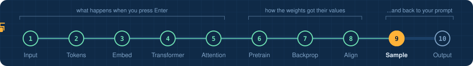
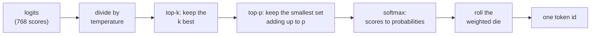

<!-- NAV -->


<p align="center"><a href="../08_alignment/">&larr; alignment</a> &nbsp;&nbsp;&middot;&nbsp;&nbsp; stage 9 of 10 &nbsp;&nbsp;&middot;&nbsp;&nbsp; <a href="../10_output/"><b>next: output &rarr;</b></a></p>
<!-- /NAV -->

<!-- DO -->
<p align="center">
<a href="https://Normansrule.github.io/transparent-transformer-llm/#9"></a>
<a href="../../notebooks/09_sampling.ipynb"></a>
<a href="https://colab.research.google.com/github/Normansrule/transparent-transformer-llm/blob/main/notebooks/09_sampling.ipynb"></a>
<a href="../../classroom/exercises/ex09.py"></a>
<a href="https://github.com/Normansrule/transparent-transformer-llm/issues/new?template=ask-the-model.yml"></a>
</p>
<!-- /DO -->

<!-- PREDICT -->
> [!IMPORTANT]
> **🎯 Predict before you read.** If you ask the same question twice, do you get the same answer? What would make it different?
>
> Hold your answer in your head. You will check it at the bottom of the page.
<!-- /PREDICT -->

# Stage 9 &middot; Sampling

> **The question:** the transformer produced 768 scores. How does that become one word?



## The idea in one breath

A language model never outputs a word. It outputs a **probability for every token in its vocabulary**. A separate, very small piece of code then rolls a weighted die. That is sampling, and it is the only place randomness enters.



| knob | low value | high value |
|---|---|---|
| **temperature** | safe, repetitive; at 0 always the top choice ("greedy") | surprising, creative, more mistakes |
| **top-k** | only a few candidates survive | the long tail is allowed in |
| **top-p** | only the confident core survives | nearly everything is allowed |

## Why the same question can give different answers

The weights did not change. The die roll did. The demo below uses the Supervised Fine-Tuning (SFT) checkpoint because it is genuinely undecided between two answer styles, so you can watch temperature decide which one you get.

## Run it

```bash
python stages/09_sampling/run.py
```

<!-- RUN:09_sampling -->
<details open>
<summary><b>Real output</b> from the model saved in this repository</summary>

```text
the SAME logits, reshaped by temperature. Probability of the top 4 candidates:

   temperature           ' R'        ' I'      ' the'        ' S'
   0.2                  86.9%       13.1%        0.0%        0.0%
   0.7                  63.2%       36.8%        0.0%        0.0%
   1.0                  59.3%       40.6%        0.0%        0.0%
   1.5                  53.9%       41.9%        0.3%        0.2%
   3.0                  13.8%       12.2%        1.0%        0.8%

   low temperature -> the favourite wins almost always.  high -> the underdogs get a chance.

temperature 0.0: five answers to 'What is the weather in Seattle?'
   Right now it is 55 degrees and cloudy in Seattle.
   Right now it is 55 degrees and cloudy in Seattle.
   Right now it is 55 degrees and cloudy in Seattle.
   Right now it is 55 degrees and cloudy in Seattle.
   Right now it is 55 degrees and cloudy in Seattle.

temperature 0.8: five answers to 'What is the weather in Seattle?'
   Right now it is 55 degrees and cloudy in Seattle.
   Right now it is 55 degrees and cloudy in Seattle.
   I cannot see live weather data, but Seattle is usually cloudy and rainy.
   I cannot see live weather data, but Seattle is usually cloudy and rainy.
   Right now it is 55 degrees and cloudy in Seattle.

temperature 2.5: five answers to 'What is the weather in Seattle?'
   Ri�1 mild mea Madrid is snow 9 Tokyo, butDondon.
   R ground.
   I cannot see city W Honolulu isB� Ralkes from usuallyell beach is about and cloudy.
   � I cannot see In usualket.ec normal What clim theregen I cannot seever tiny mild andly. The What?hen Isonolulu Honolulu is New York isch.
   stals R seeid windy and clear.

->  python stages/10_output/run.py
```

</details>
<!-- /RUN -->

## Read the code

[`transparent_transformer/sampling.py`](../../transparent_transformer/sampling.py): `sample_next()` is the die, `generate()` is the loop around it.

<!-- QUIZ -->
## Check yourself

*Your prediction from the top of the page: was it right? Now this one.*

**With temperature set to 0, asking the same question twice gives...** &nbsp; Click an answer.

<details><summary>A. The same answer: it always takes the top token</summary>

> ✅ **Yes.** Randomness only enters at the sampling step. Temperature 0 removes it. Try it with the slider above.

</details>

<details><summary>B. A different answer each time</summary>

> ❌ Not quite. Close this and try another one.

</details>

<details><summary>C. An error</summary>

> ❌ Not quite. Close this and try another one.

</details>

**Your turn:** open [`classroom/exercises/ex09.py`](../../classroom/exercises/ex09.py), press the pencil icon to edit it right on GitHub (in your fork), fill in the function and commit; or run `python classroom/check.py` locally. [How the exercises work.](../../START_HERE.md#the-exercises-three-ways)
<!-- /QUIZ -->

---

### The hand-off

We have **one** token. The answer needs about fifteen. So the token is glued onto the end of the input and the *entire* model, stages 3 to 5, runs again. And again.

## [Continue to stage 10: Output &rarr;](../10_output/)
