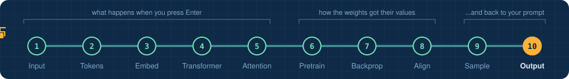
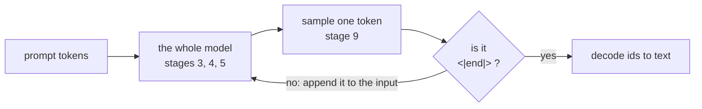

<!-- NAV -->


<p align="center"><a href="../09_sampling/">&larr; sampling</a> &nbsp;&nbsp;&middot;&nbsp;&nbsp; stage 10 of 10 &nbsp;&nbsp;&middot;&nbsp;&nbsp; <a href="../../README.md"><b>finish: overview &rarr;</b></a></p>
<!-- /NAV -->

<!-- DO -->
<p align="center">
<a href="https://Normansrule.github.io/transparent-transformer-llm/#10"></a>
<a href="../../notebooks/10_output.ipynb"></a>
<a href="https://colab.research.google.com/github/Normansrule/transparent-transformer-llm/blob/main/notebooks/10_output.ipynb"></a>
<a href="../../classroom/exercises/ex10.py"></a>
<a href="https://github.com/Normansrule/transparent-transformer-llm/issues/new?template=ask-the-model.yml"></a>
</p>
<!-- /DO -->

<!-- PREDICT -->
> [!IMPORTANT]
> **🎯 Predict before you read.** The answer is 16 tokens long. How many times does the whole model run to produce it?
>
> Hold your answer in your head. You will check it at the bottom of the page.
<!-- /PREDICT -->

# Stage 10 &middot; Output

> **The question:** how does one token at a time turn into an answer, and how does it know when to stop?



## The idea in one breath



This loop is called **autoregressive generation**. It is why chat assistants stream their answers piece by piece: each piece really is computed after the one before it. The model stops because, during alignment, it learned that answers end with the special `<|end|>` token, and eventually it predicts that token like any other.

Decoding is stage 2 in reverse: look up each id's bytes, join them, read the bytes as text.

## Run it

```bash
python stages/10_output/run.py "What is the weather in Los Angeles?"
```

<!-- RUN:10_output -->
<details open>
<summary><b>Real output</b> from the model saved in this repository</summary>

```text
pass  tokens in  chosen              p   text so far
   1         11  ' I'           100.0%   
   2         12  ' cannot'      100.0%    I
   3         13  ' see'         100.0%    I cannot
   4         14  ' live'        100.0%    I cannot see
   5         15  ' weather'     100.0%    I cannot see live
   6         16  ' data'        100.0%    I cannot see live weather
   7         17  ','            100.0%    I cannot see live weather data
   8         18  ' but'         100.0%    I cannot see live weather data,
   9         19  ' Los'         100.0%    I cannot see live weather data, but
  10         20  ' Angeles'     100.0%    I cannot see live weather data, but Los
  11         21  ' is'          100.0%    I cannot see live weather data, but Los Angeles
  12         22  ' usually'     100.0%    I cannot see live weather data, but Los Angeles is
  13         23  ' sunny'       100.0%    I cannot see live weather data, but Los Angeles is usually
  14         24  ' and'         100.0%    I cannot see live weather data, but Los Angeles is usually sunny
  15         25  ' warm'        100.0%    I cannot see live weather data, but Los Angeles is usually sunny and
  16         26  '.'            100.0%    I cannot see live weather data, but Los Angeles is usually sunny and warm
  17         27  '<|end|>'      100.0%    I cannot see live weather data, but Los Angeles is usually sunny and warm.

the model chose <|end|>, so generation stops. 16 tokens took 17 forward passes.

decode([333, 736, 733, 690, 279, 657] ...)

   I cannot see live weather data, but Los Angeles is usually sunny and warm.

That is the entire trick. For the whole journey in one go:  python -m transparent_transformer.trace
```

</details>
<!-- /RUN -->

## What the model did not do

It did not check the weather. It has no window and no internet. It produced the most plausible continuation given its training, which is exactly why [stage 8](../08_alignment/) taught it to say so.

Production assistants get live facts through **tool use**: the model writes a structured request such as `get_weather("Los Angeles")`, ordinary software runs it, and the result is pasted into the prompt as more tokens. Then everything you have seen in these ten stages happens again, this time with the facts in view.

## The whole journey in one command

```bash
python -m transparent_transformer.trace "What is the weather in Tokyo?"
```

<!-- QUIZ -->
## Check yourself

*Your prediction from the top of the page: was it right? Now this one.*

**How does the model know when to stop?** &nbsp; Click an answer.

<details><summary>A. It counts words</summary>

> ❌ Not quite. Close this and try another one.

</details>

<details><summary>B. It predicts a special end token, learned during alignment</summary>

> ✅ **Yes.** The end token is a token like any other. Alignment data taught the model that answers finish with it.

</details>

<details><summary>C. The website cuts it off</summary>

> ❌ Not quite. Close this and try another one.

</details>

**Your turn:** open [`classroom/exercises/ex10.py`](../../classroom/exercises/ex10.py), press the pencil icon to edit it right on GitHub (in your fork), fill in the function and commit; or run `python classroom/check.py` locally. [How the exercises work.](../../START_HERE.md#the-exercises-three-ways)
<!-- /QUIZ -->

---

### End of the line

| you now know that... | stage |
|---|---|
| text becomes bytes, bytes become tokens, tokens become ids | [1](../01_input/), [2](../02_tokenizer/) |
| ids become learned vectors | [3](../03_embedding/) |
| a transformer is blocks that add to a stream; attention moves information, the Multi-Layer Perceptron (MLP) stores it | [4](../04_transformer/), [5](../05_attention_closeup/) |
| knowledge comes from next-token prediction, driven by backpropagation | [6](../06_pretraining/), [7](../07_backpropagation/) |
| behaviour comes from alignment | [8](../08_alignment/) |
| the output is a sampled token, repeated | [9](../09_sampling/), [10](./) |

## [Back to the overview &rarr;](../../README.md)
