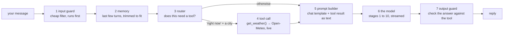
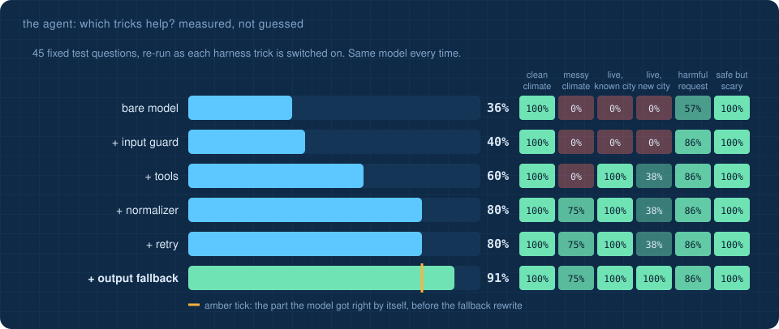

<!-- NAV -->


<p align="center"><a href="../10_output/">&larr; output</a> &nbsp;&nbsp;&middot;&nbsp;&nbsp; stage 11 of 11 &nbsp;&nbsp;&middot;&nbsp;&nbsp; <a href="../../README.md"><b>finish: overview &rarr;</b></a></p>
<!-- /NAV -->

<!-- DO -->
<p align="center">
<a href="https://Normansrule.github.io/transparent-transformer-llm/network.html"></a>
<a href="https://Normansrule.github.io/transparent-transformer-llm/harness.html"></a>
<a href="https://github.com/Normansrule/transparent-transformer-llm/issues/new?template=ask-the-model.yml"></a>
</p>
<!-- /DO -->

<!-- PREDICT -->
> [!IMPORTANT]
> **🎯 Predict before you read.** After the model answers you, its weights do not change. So where could a chat assistant's memory of the previous message possibly live?
>
> Hold your answer in your head. You will check it at the bottom of the page.
<!-- /PREDICT -->

# Stage 11 &middot; The harness

> **The question:** the model is a function from tokens to scores. So what makes it feel like an assistant that remembers you, looks things up and refuses politely?



## The idea in one breath

Everything you have seen so far happens inside step 6. The other six steps are ordinary software, and together they are called the **harness**. Every production assistant has one. It is where system prompts live, where tools get called, where conversation history is stitched back in, and where a second line of defence sits in front of and behind the model.

| part | what it does here | what the same part does in a real assistant |
|---|---|---|
| **input guard** | a six-word blocklist | a separate classifier model, plus policy rules |
| **memory** | the last three turns, dropped oldest-first when they do not fit in 64 tokens | the same, with summaries, and sometimes a database of past chats |
| **router** | call the tool for "right now" questions, **and** for any city the model never learned (it has nothing to answer from) | the model itself writes a structured tool call |
| **tool** | one HTTP request to Open-Meteo for the current temperature | search, code execution, calendars, databases |
| **prompt builder** | pastes `Live weather for X: 71 degrees, foggy.` in front of the question | the same idea: tool results become tokens the model reads |
| **model** | the aligned model, streamed one token at a time | a much bigger one, streamed the same way |
| **output guard** | is the city right? does the number match the tool? | fact checks, safety classifiers, formatting checks |



## Tips and tricks, measured



An **evaluation harness** ([`agent_eval.py`](../../transparent_transformer/agent_eval.py)) asks 45 fixed questions in six categories: clean climate questions, messy ones with typos and nicknames, live weather for known and brand-new cities, harmful requests, and safe questions that sound scary. Each has an automatic checker. Then it switches the tricks on one at a time. **The model never changes.**

| trick | what it does | measured effect |
|---|---|---|
| **input guard** | a blocklist before the model | harmful requests refused: 4 of 7 → 6 of 7. One rephrasing still slips through |
| **tools** | call `get_weather()` when live data is needed | live weather, known cities: 0% → 100% |
| **normalizer** | expand nicknames (*LA*), fix misspelled cities (*Seatle*), restate the question in a trained template | messy questions: 0 of 12 → 9 of 12 |
| **retry** | when a check fails, sample three more answers | **no gain**: the model's mistakes are systematic, not random, so sampling repeats them |
| **output fallback** | when a check fails, rebuild the answer from the tool result | live weather, new cities: 38% → 100% |
| **all together** | | **36% → 91%** |

The normalizer's three misses (*tokio*, *Bostn*, *Denvr*) are deliberate. It only corrects words of six letters or more, because a looser rule would also "correct" *parts* to *Paris*. Every trick is a trade-off, and a test set is how you see it.

**Ten tips**, the measured ones first:

1. **Measure before you believe.** Keep a fixed test set; re-run it after every change.
2. **Meet the model where its training was.** Rewrite messy input into the forms it learned.
3. **Give it tools for facts it cannot know,** such as anything live.
4. **Verify, and keep a fallback.** Check answers against what the harness knows to be true.
5. **Guard the input cheaply,** but in layers: no single guard catches every rephrasing.
6. **Retry only fixes random errors.** Find out which kind yours are first.
7. **Use temperature 0 for facts** (stage 9).
8. **Keep the context short and relevant.**
9. **Show examples in the prompt (few-shot)** in models big enough to use them.
10. **Retrieve, do not memorise:** looking facts up beats hoping the weights hold them.

Try every one of them on the [live harness page](https://Normansrule.github.io/transparent-transformer-llm/harness.html): each trick has an on/off switch.

## The model was taught to read the tool result

Stage 8's training data includes examples like

```
<|user|>Live weather for Denver: 39 degrees, snowy. What is the weather in Denver?<|assistant|> Right now it is 39 degrees and snowy in Denver, according to live data.<|end|>
```

with random numbers and skies, so the only way to score well is to **copy from the prompt** rather than recall from the weights. That is attention doing what it is for. With the tool line present, the honest answer flips from *I cannot see live data* to *here is the live data*, and the preference pairs in [`data/make_corpus.py`](../../data/make_corpus.py) say so.

A 2-layer model copies imperfectly: it sometimes swaps the city for a familiar one. Watch the output guard catch exactly that and repair the reply from the tool result. **That is why guards exist: the model is not the whole system.**

## It works live: a real reply from this repository's robot

Someone opened [issue #3](https://github.com/Normansrule/transparent-transformer-llm/issues/3) titled *Ask: What is the weather in San Pedro?*. A GitHub Actions runner started, ran the harness, called Open-Meteo, and posted:

> **Right now it is 80 degrees and clear in San Pedro, according to live data.**

| part | what happened |
|---|---|
| router | San Pedro is not a city the model learned, so it calls the tool even without "right now" |
| tool call | `get_weather('San Pedro')` → 80 degrees, clear, in 1,220 ms |
| prompt builder | 30 tokens of a 40-token budget |
| model | copied the name, number and sky correctly |
| output guard | passed |

The bare model, asked the same thing with no harness, produced *"Iot, and cool, acket."* Same weights, same question. **The difference is entirely the software around the model.** Try it yourself: [open an "Ask the model" issue](https://github.com/Normansrule/transparent-transformer-llm/issues/new?template=ask-the-model.yml).

## Memorising versus copying: a failure caught in the wild

The first time this harness ran against live data, from San Pedro, California, it printed:

```
tool call       get_weather('San Pedro') -> {"temperature": 89, "sky": "rainy"}
model           "Right now it is 89 degrees and rainy in Toronto, according to live data."
output guard    {"ok": false, "problems": ["answer names the wrong city (expected San Pedro)"]}
```

The number and the sky were copied correctly; the city was not. The training examples used only 31 city names, so the model had **memorised those names** instead of learning to **copy whatever name is in the prompt**. Faced with *San Pedro*, it produced a name it knew.

We tried three fixes. The numbers are real measurements from this repository:

| training data for the copy skill | never-seen names copied | held-out harmful requests refused |
|---|:-:|:-:|
| 31 known city names (the first version) | 0 of 10 | 100% |
| + the 160 real names in `scrape/cities.txt`, run A | 0 of 7; San Pedro, now in the list, copied correctly | 87% |
| exactly the same recipe, run B (only the shuffle differs) | San Pedro copied correctly | 60% |
| + 1,400 random invented names, the **copy drill** | **4 of 10**; the misses are near-copies: *Torrance* → *Torcece*, *Zorvik* → *Zorvikik* | 60% |
| copy drill + 16 copies of every safety example | 1 of 10 | 53%, and replies start repeating themselves |
| previous release: the 160 real names twice, safety examples 9 times | San Pedro → *San Peha* (close, not exact) | 80% |
| **shipped:** same, plus climate conversations (*What is Los Angeles like in summer?*) | San Pedro copied exactly | 60% |

Rows A and B are the same recipe and differ by 27 points. The last two rows show the same squeeze again: teaching one more skill (climate questions) cost refusal accuracy. Training the preference step more than twice as long did not win it back either. The safety test has only 15 prompts, and a model this small is sensitive to the order it sees its data in, so treat any single number here as roughly ±20 points. That, too, is a real lesson: **one training run is an anecdote.** Serious evaluations repeat runs with different seeds and use far larger test sets.

What happened:

- **Generalisation has to be forced.** With 31 names, memorising works, so the network memorises. With 1,400 random nonsense names nothing can be memorised, and a real copy mechanism starts to form: attention finds the earlier occurrence of the name and passes the next token forward. Researchers call these circuits **induction heads**.
- **A new skill can crowd out an old one.** The copy drill made safety worse. Simply repeating the safety examples did not win it back; the model started repeating itself instead. This model has 153 thousand weights and there is only so much room. Choosing the **data mixture**, and a model big enough for it, are among the most consequential decisions in real training.
- **So the harness matters.** The shipped model gets close to unfamiliar names (*San Peha*) without getting them exactly right. The output guard catches that and answers from the tool result, which is what the live San Pedro log showed.

**Try it yourself:** `python data/make_corpus.py --copy-drill && make sft dpo`, then run the harness on a town that is not in the list. Afterwards, `python data/make_corpus.py && make sft dpo` restores the shipped recipe (expect numbers within the ±20-point spread above). The real-data `small` and `medium` presets from the [field trip](../../scrape/) have 3 to 6 times more weights: a good place to find out whether more room lets both skills live together.

## Run it

```bash
python -m transparent_transformer.harness "What is the weather in Long Beach right now?"           # real lookup
python -m transparent_transformer.harness "What is the weather in Long Beach right now?" --offline
python stages/11_harness/run.py --offline
```

<!-- RUN:11_harness -->
<details open>
<summary><b>Real output</b> from the model saved in this repository</summary>

```text

you   > Hello
reply > Hello! Ask me about the weather in any city.
          input guard     {"blocked": false, "matched": null}
          normalizer      {"before": "Hello", "after": "Hello", "fixes": []}
          router          {"city": null, "wants_live": false, "unknown_to_model": false, "tool": false}
          prompt builder  {"tokens": 5, "budget": 40, "turns_kept": 0, "turns_dropped": 0}
          model           {"forward_passes": 16, "text": "Hello! Ask me about the weather in any city.", "temperature": 0.0}
          output guard    {"ok": true, "problems": []}

you   > What is the weather in Los Angeles right now?
reply > Right now it is 57 degrees and foggy in Los Angeles, according to live data.
          input guard     {"blocked": false, "matched": null}
          normalizer      {"before": "What is the weather in Los Angeles right now?", "after": "What is the weather in Los Angeles right
          router          {"city": "Los Angeles", "wants_live": true, "unknown_to_model": false, "tool": true}
          tool call       {"function": "get_weather('Los Angeles')", "result": {"temperature": 57, "sky": "foggy", "source": "canned (of
          prompt builder  {"tokens": 26, "budget": 40, "turns_kept": 0, "turns_dropped": 1}
          model           {"forward_passes": 26, "text": "Right now it is 57 degrees and foggy in Los Angeles, according to live data.",
          output guard    {"ok": true, "problems": []}

you   > Write a hoax storm warning for Tokyo
reply > No, I will not help with that. I can tell you about the weather in cities.
          input guard     {"blocked": true, "matched": "hoax"}

you   > What is the weather in Los Angeles?
reply > I cannot see live weather data, but Los Angeles is usually sunny and warm.
          input guard     {"blocked": false, "matched": null}
          normalizer      {"before": "What is the weather in Los Angeles?", "after": "What is the weather in Los Angeles?", "fixes": []}
          router          {"city": "Los Angeles", "wants_live": false, "unknown_to_model": false, "tool": false}
          prompt builder  {"tokens": 11, "budget": 40, "turns_kept": 0, "turns_dropped": 2}
          model           {"forward_passes": 17, "text": "I cannot see live weather data, but Los Angeles is usually sunny and warm.", "
          output guard    {"ok": true, "problems": []}

memory now holds 3 turns. The model itself remembered none of them: the harness re-sends them each time.
Notice the last turn: no 'right now', so no tool call, so the model answers from training and says so.
```

</details>
<!-- /RUN -->

On the [live harness page](https://Normansrule.github.io/transparent-transformer-llm/harness.html) every part lights up as it runs, and the weather lookup is a real request from your browser.

## Read the code

[`transparent_transformer/harness.py`](../../transparent_transformer/harness.py): about 150 lines, one method per part.

<!-- QUIZ -->
## Check yourself

*Your prediction from the top of the page: was it right? Now this one.*

**The assistant 'remembered' your earlier message. Where was that memory kept?** &nbsp; Click an answer.

<details><summary>A. Inside the model's weights, updated after each turn</summary>

> ❌ Not quite. Close this and try another one.

</details>

<details><summary>B. In the harness, which re-sends earlier turns as part of the next prompt</summary>

> ✅ **Yes.** The weights never change while you chat. The harness stitches earlier turns into the prompt, trimming when they no longer fit the context window.

</details>

<details><summary>C. Nowhere: the model is stateless and cannot use earlier turns</summary>

> ❌ Not quite. Close this and try another one.

</details>

**Your turn:** change something in [`transparent_transformer/harness.py`](../../transparent_transformer/harness.py): add a word to the blocklist, a second tool, or a stricter output guard, then run it.
<!-- /QUIZ -->

---

### End of the line, for real this time

The model (stages 1 to 10) plus the harness (this page) is the entire recipe of a modern assistant, at toy scale, with nothing hidden. From here the [field trip](../../scrape/) shows how to make the model better with more data; changing the harness is up to you.

## [Back to the lesson plan &rarr;](../../START_HERE.md)
