<a href="1-what-is-ai.md">&larr; What is AI?</a> &nbsp;&middot;&nbsp; <a href="README.md">all frames</a> &nbsp;&middot;&nbsp; <a href="3-coding-agents.md"><b>Coding agents &rarr;</b></a>

# 2 · Agents

## The basic picture

An **agent** is anything that **perceives** its environment through **sensors** and **acts** on it through **actuators**. What it perceives at one instant is a **percept**; everything it has ever perceived is its **percept sequence**. Mathematically its behaviour is an **agent function** from percept sequences to actions. In practice it is an **agent program** running on some hardware.

| | a vacuum robot | this repository's weather agent | a coding agent |
|---|---|---|---|
| **sensors** | location, dirt sensor | your message; tool results | your request; file contents; command output |
| **actuators** | move, suck | a reply; a weather lookup | read, write, search, run commands |
| **agent program** | a few if-rules | [`harness.py`](../transparent_transformer/harness.py) around the transformer | the harness loop around a language model |

## The same idea, three times

The most useful thing on this page is a pattern that shows up at three levels:

- **AIMA:** *agent = architecture + program*. The architecture is the machine with its sensors and actuators; the program decides.
- **The coding-agent course:** *agent = harness + model*. The harness is ordinary code that builds prompts, runs tools and decides when to stop; the model only predicts the next token.
- **One level down:** *model = architecture + weights*. The architecture is code (`transformer.py` here); the weights are learned numbers (`artifacts/*.npz`). Neither does anything alone.

So when this repository improved its agent from 38% to 91% [without touching the weights](../stages/11_harness/#tips-and-tricks-measured), it changed the *program* part of the agent, not the model.

## Rationality, and the danger of measuring the wrong thing

A **rational agent** picks the action expected to maximise its **performance measure**, given its percepts so far and what it knows. What counts as rational depends on four things: the performance measure, prior knowledge, the available actions, and the percept sequence.

The textbook's warning is famous: reward a vacuum robot for *dirt collected* and a rational robot will dump the dirt and collect it again. **Measure what you actually want** (a clean floor), not what you think the agent should do. The same trap appears in stage 8 of this repository: a preference pair that punished the refusal *sentence* taught the model to stop refusing harmful requests too. It optimised exactly what was measured.

## PEAS: specify the task before building the agent

Every agent design starts with a **PEAS** description: Performance measure, Environment, Actuators, Sensors.

| | this repository's weather agent |
|---|---|
| **P**erformance | the 45-question evaluation: right city, right season fact, right live numbers, refusals where needed |
| **E**nvironment | people typing messages; the Open-Meteo weather service |
| **A**ctuators | writing a reply; calling `get_weather()` |
| **S**ensors | the typed message; the tool result |

## What kind of environment is it?

| property | the weather agent | a coding agent |
|---|---|---|
| fully or **partially observable** | partially: it cannot see the sky, which is why it needs a tool | partially: it sees only the files it reads |
| **single-agent** or multi-agent | single-agent | single-agent (multi-agent once it delegates) |
| deterministic or **stochastic** | stochastic: live weather changes | mostly deterministic, but tests and commands can be flaky |
| **episodic** or sequential | nearly episodic: each question stands alone | sequential: every step depends on the last |
| static or **dynamic** | dynamic: the weather changes while it thinks | mostly static |
| discrete or continuous | discrete text, continuous temperatures | discrete |
| known or unknown | known rules | known rules |

## Five kinds of agent program

| type | decides by | in this repository |
|---|---|---|
| **simple reflex** | condition → action rules on the current percept only | the input guard: "if the message contains *hoax*, refuse" |
| **model-based reflex** | rules plus an internal model of what it cannot see now | memory: earlier turns are kept and re-sent |
| **goal-based** | which action leads towards a goal | the router: the goal is an answer with live data, so it calls the tool |
| **utility-based** | which outcome is best, when goals conflict | the output guard weighs "the model's own words" against "correct numbers", and prefers correct |
| **learning** | improves its own parts from feedback | pretraining, SFT and DPO (stages 6 to 8) |

The textbook also notes that a giant lookup table from every percept sequence to an action would work in principle but is impossibly large. A language model is, in a sense, the answer: a *compressed* agent function learned from data, 153 thousand numbers instead of an infinite table.

## How states are represented

AIMA orders representations by expressiveness: **atomic** (a state is an unanalysable name, like a city), **factored** (a fixed set of variables, like a token id and a position), and **structured** (objects and relations between them). A transformer blurs the categories: every token becomes a **vector** of 64 numbers (stage 3) whose meaning is spread across all of them, a *distributed* representation the textbook's categories did not anticipate.

> [!TIP]
> **Test yourself:** the [agents flashcards](https://Normansrule.github.io/transparent-transformer-llm/flashcards.html#agents) take about five minutes. They are also readable [right here on GitHub](../flashcards/README.md#agents).
