<a href="2-agents.md">&larr; Agents</a> &nbsp;&middot;&nbsp; <a href="README.md">all frames</a> &nbsp;&middot;&nbsp; <a href="4-history.md"><b>History &rarr;</b></a>

# 3 · Coding agents

## The claim: the harness is most of the agent

Sebastian Raschka's article [*Components of a Coding Agent*](https://magazine.sebastianraschka.com/p/components-of-a-coding-agent) argues that what separates a good coding agent from a bad one is often the software around the model, not the model. His [mini-coding-agent](https://github.com/rasbt/mini-coding-agent) makes the point in one readable file. This repository's measured result says the same thing at toy scale: **same weights, 38% → 91%**.

## Six components, three systems

| # | component (Raschka) | in his coding agent | in this repository |
|:-:|---|---|---|
| 1 | **live context** | reads the repository once at start-up: branch, git status, README | fetches live weather when a question needs it |
| 2 | **prompt shape and cache reuse** | a fixed prefix (rules, tools, examples) and a changing tail, so a server can reuse work on the prefix | a fixed chat template, `<\|user\|>...<\|assistant\|>` (stage 8) |
| 3 | **tool access and use** | the model *writes* a tool call; the harness checks the name, the arguments and the file path, asks for approval, then runs it | the model cannot write tool calls, so the **router decides** instead |
| 4 | **minimising context bloat** | clip tool output; keep recent turns in full and older ones short | memory is trimmed oldest-first to fit 40 tokens |
| 5 | **structured session memory** | the whole transcript saved as JSON after every turn, so a crash can resume | the last three turns, in memory only |
| 6 | **bounded delegation** | a read-only helper agent, one level deep, returning one string | not built: a good exercise |

Things this repository adds that a model big enough to follow instructions rarely needs: an **input guard**, a **normalizer** that rewrites messy questions into trained forms, and an **output guard** that checks and repairs answers. A tiny model needs more help from its harness.

## The GPT-2 agent project, seen from here

The CSC 411/511 project puts a real GPT-2 (124 million parameters) behind the same kind of harness. Its experiment is a clean version of lessons in this repository:

| the project's step | what happens | the same idea here |
|---|---|---|
| run the base model | it continues text; asked a question, it keeps writing | stage 6: the base model rambles on about other cities |
| serve it over HTTP, connect the agent | the agent sends one long prompt and gets back prose, never a tool call | stage 8: before alignment, format and behaviour are missing |
| build two datasets | instruction pairs (**loss on the reply only**) versus raw code (**loss on every token**) | stage 8: the SFT **loss mask** grades only the answer |
| fine-tune on one, then the other | which one makes the model call tools? | stage 8 and 11: *format* comes from alignment data, not from more text |
| targets **correct by construction** | the script builds each repository first, so it knows the right tool call | [`data/make_corpus.py`](../data/make_corpus.py) writes the facts first, then the questions about them |

Two numbers worth connecting:

- **Context window.** GPT-2 sees 1,024 tokens; the project's lean prompt uses about half before you ask anything. This model sees 64. Both harnesses spend most of their effort deciding what fits.
- **Parameter count.** The project's code reports 163,037,184 parameters for GPT-2 small, while the published figure is 124 million. The difference, 38,597,376, is exactly 50,257 × 768: a separate output layer instead of reusing the embedding table. This repository's [parameters explorer](https://Normansrule.github.io/transparent-transformer-llm/parameters.html) counts with **weight tying** and reproduces 124,439,808.

## One principle from both

A model does one thing: text in, text out. It holds no files, runs nothing and remembers nothing between requests. Everything else, from reading a file to deciding to stop, is ordinary code you can read. **The model names an action; the harness decides whether it happens.**

> [!TIP]
> **Test yourself:** the [coding agents flashcards](https://Normansrule.github.io/transparent-transformer-llm/flashcards.html#coding-agents) take about five minutes. They are also readable [right here on GitHub](../flashcards/README.md#coding-agents).
