<a href="4-history.md">&larr; History</a> &nbsp;&middot;&nbsp; <a href="README.md">all frames</a> &nbsp;&middot;&nbsp; <a href="6-ai-at-work.md"><b>AI at work &rarr;</b></a>

# 5 · Minds and machines

> [!NOTE]
> This is an open scientific question. The theories below disagree with each other, and each has serious critics. The page lays out what each claims, what it would mean for a model like this one, and the main objections, so you can weigh them yourself.

## Why this belongs in a course about transformers

After ten stages you know exactly what this model does: it multiplies 153,344 numbers, one token at a time. Nothing is hidden. So the question "is anything it *feels like* to be this model?" can be asked with unusual precision. Different theories give strikingly different answers, and they turn on facts you now understand: whether processing is feedforward, whether it is classical or quantum, and whether substrate matters.

## The four positions

| | core claim | proponents | a transformer like this one would be... | main objections |
|---|---|---|---|---|
| **Computational views** (functionalism, Global Workspace Theory) | consciousness comes from the right *organisation* of information processing, whatever it runs on | Dennett; Baars and Dehaene (global workspace) | not conscious now, but a future AI with the right architecture could be | may leave out *why* any processing feels like anything (the "hard problem") |
| **Integrated Information Theory (IIT)** | consciousness *is* integrated information, Φ: how much a system's causal structure is more than its parts | Tononi (2004), Christof Koch | not conscious: a single forward pass is feedforward, which gives Φ = 0; even a perfect brain simulation on ordinary hardware would not be | Φ cannot be computed for real systems; it predicts some simple grids of logic gates are highly conscious; in 2023 an open letter from 124 researchers called it pseudoscience, which drew strong rebuttals |
| **Orch OR** (orchestrated objective reduction) | moments of consciousness are quantum state reductions inside **microtubules** in neurons, timed by a gravity-related threshold | Roger Penrose, Stuart Hameroff | not conscious, and not able to be: understanding is not computation, and no classical computer has the physics | the brain is warm and wet; Tegmark (2000) estimated quantum coherence there would last only about 10⁻¹³ to 10⁻²⁰ seconds, far too short; the simplest version of the underlying collapse model was constrained by an underground experiment in 2020; defenders dispute both |
| **Consciousness as fundamental** (quantum information) | consciousness and free will are basic features of reality, linked to quantum information that cannot be copied | Federico Faggin | not conscious: a classical, copyable, deterministic machine lacks what matters | hard to test; departs from mainstream physics and neuroscience |

## Orch OR in a little more depth

The 2014 review by Hameroff and Penrose ([Physics of Life Reviews 11: 39–78](https://doi.org/10.1016/j.plrev.2013.08.002)) makes four linked claims:

1. **Where:** in microtubules, the protein lattices inside every neuron, built from subunits called tubulin.
2. **What:** tubulins hold quantum superpositions that evolve together, *orchestrated* by the neuron's biology.
3. **When:** each superposition ends by **objective reduction** when it reaches a threshold set by gravity, roughly τ ≈ ħ / EG: the larger the mass separation EG, the sooner the collapse. Each collapse is a moment of experience.
4. **Evidence they cite:** consciousness correlates best with gamma-band brain rhythms (30–90 Hz), which they link to slower "beats" of much faster microtubule vibrations; and anaesthetics, which switch consciousness off, appear to act on microtubules.

## A neuron is not a perceptron

The [perceptron page](https://Normansrule.github.io/transparent-transformer-llm/perceptron.html) treats a neuron as one weighted sum and a switch. A 1990 paper by Rasmussen, Karampurwala, Vaidyanath, Jensen and Hameroff (*Physica D* 42: 428–449) argues real neurons are closer to whole computers. They modelled the microtubule lattice as a **cellular automaton**, where each subunit flips state based on its neighbours, and showed such a lattice could learn associations.

Their back-of-envelope comparison is striking. Counting synapses the way Hans Moravec did gives the brain about **4 × 10¹⁵ bits per second**. Counting about 10¹⁴ microtubule subunits changing state 10⁹ to 10¹¹ times a second gives **10²³ to 10²⁵**. The authors themselves call the question of whether cognition needs that capacity "presently unanswerable". Two more points from the paper connect directly to this course: they note that **backpropagation**, which trains every model here, has no obvious equivalent in real neurons; and that the brain's "switches" are themselves complex machines.

## Hear it from the people involved

- Christof Koch on Integrated Information Theory: [video](https://www.youtube.com/watch?v=1V-5t0ZPY7E) · [overview](https://en.wikipedia.org/wiki/Integrated_information_theory)
- Federico Faggin on quantum fields and consciousness: [talk 1](https://www.youtube.com/watch?v=0FUFewGHLLg&t=4575s) · [talk 2](https://www.youtube.com/watch?v=cXlxCOoNZ7E&t=5s)
- Roger Penrose and Federico Faggin in a round-table discussion: [video](https://www.youtube.com/watch?v=0nOtLj8UYCw)
- For the computational side: Butlin, Long and colleagues, [*Consciousness in Artificial Intelligence: Insights from the Science of Consciousness*](https://arxiv.org/abs/2308.08708) (2023), which checks today's AI systems against the indicator properties that several theories propose

## Questions to argue about

1. Within one token, this model is strictly feedforward. Across tokens it feeds its own output back in (stage 10). Does that loop change IIT's verdict?
2. If Orch OR is right, would a brain simulated perfectly on a classical computer behave like a person while experiencing nothing?
3. What experiment would change your mind about any of the four positions?

> [!TIP]
> **Test yourself:** the [minds and machines flashcards](https://Normansrule.github.io/transparent-transformer-llm/flashcards.html#minds-and-machines) take about five minutes. They are also readable [right here on GitHub](../flashcards/README.md#minds-and-machines).
