<a href="6-ai-at-work.md">&larr; AI at work</a> &nbsp;&middot;&nbsp; <a href="README.md">all frames</a> &nbsp;&middot;&nbsp; <a href="8-claude-and-chatgpt.md"><b>Claude and ChatGPT &rarr;</b></a>

# 7 · Beyond the transformer

Everything in this repository is a **transformer**: attention plus perceptron layers, generating one token at a time. That recipe has dominated since 2017, but it has two well-known costs, and most new model types attack one of them:

1. **Attention looks at every earlier token**, so its cost grows with the square of the context length.
2. **Generation is one token at a time**, so a long answer takes as many full passes as it has tokens (stage 10).

## 1 · Mixture of experts: more knowledge, same cost per token

Replace each block's single perceptron layer (the MLP) with many **experts** and a small **router** that sends each token to only a few of them. The model can hold far more parameters while each token uses only a fraction. Well-documented examples: AI21's Jamba had 52 billion parameters with 12 billion active per token, and Jamba 1.5 grew to 398 billion with 94 billion active. OpenAI's open-weight gpt-oss models (20B and 120B) use the same idea.

**Try it on the real model:** the [Beyond page](https://Normansrule.github.io/transparent-transformer-llm/beyond.html) splits this model's 256 perceptron neurons into 8 pretend experts and keeps the top 2 for each token. Grouped in order, only about 35% of the true output survives, because a dense model spreads its signal everywhere. Regrouped by which neurons fire together, about 50% survives. Real mixture-of-experts models are trained with the router from the start, so their experts specialise far more.

*Connect it:* stage 4's MLP is one expert. The [parameters explorer](https://Normansrule.github.io/transparent-transformer-llm/parameters.html) counts **total** parameters; a mixture-of-experts model also has a much smaller **active** count.

## 2 · State space models and hybrids: linear time, constant memory

A **state space model** (SSM) reads a sequence like a recurrent network: it squeezes everything so far into a fixed-size state, `h = A·h + B·x`, and emits `y = C·h`. Each new token costs the same no matter how long the history, and memory does not grow. Mamba (Gu and Dao, December 2023) made the dynamics depend on the input, so the model can choose what to keep and what to forget. Mamba-2 (2024) showed these models are a structured form of attention, and Mamba-3 appeared at ICLR 2026.

The catch: a fixed-size state cannot remember everything exactly, so pure SSMs are weaker at precise recall, the very thing attention is good at (stage 5). The designs that have shipped at scale are therefore **hybrids**: Jamba uses one attention layer for every seven Mamba layers, and NVIDIA's Nemotron hybrids interleave attention with Mamba-2 layers.

## 3 · Diffusion language models: write everything at once, then refine

Image generators start from noise and **denoise**. Diffusion language models do the same with text: start with every position masked, predict all of them in parallel, keep the confident ones, and repeat for a few steps. They can revise earlier words and use context on both sides. LLaDA showed the approach scales; Inception Labs' Mercury was the first commercial-scale diffusion language model, and Google showed an experimental Gemini Diffusion. Vendors report speed-ups of 5 to 10 times over comparable autoregressive models; independent comparisons are still maturing.

*Connect it:* the left half of the animation is exactly stage 10. The [Beyond page](https://Normansrule.github.io/transparent-transformer-llm/beyond.html) also has a slider showing how attention's cost and memory run away from a state space model's as the context grows. The right half is the alternative.

## 4 · Reasoning models: spend compute at answer time

Instead of answering at once, **reasoning models** write out intermediate thinking before the answer and are trained with reinforcement learning on problems whose answers can be checked (maths, code). OpenAI's o1 (2024) and DeepSeek-R1 (2025) made this mainstream; most flagship assistants now choose how long to think.

*Connect it:* this repository measured that plain **retry** added nothing, because the tiny model's mistakes are systematic. Reasoning models change that: they are trained to *search* for a better answer, not just to roll the dice again.

## 5 · Further out: experimental ideas worth knowing

| idea | the change | where it connects here |
|---|---|---|
| **Kolmogorov–Arnold Networks (KANs)**, 2024 | put learnable functions on the connections instead of fixed switches on the neurons | the [perceptron](https://Normansrule.github.io/transparent-transformer-llm/perceptron.html): its sigmoid is fixed; a KAN learns its curves |
| **Spiking neural networks** and neuromorphic chips | neurons send timed spikes, and hardware only works when a spike arrives | closer to real neurons ([frame 5](5-minds-and-machines.md)); very energy-efficient |
| **World models and JEPA** (Yann LeCun's proposal) | predict in an abstract representation space rather than predicting every word or pixel | the embedding space of stage 3, taken much further |
| **Quantum machine learning** | variational quantum circuits trained like small neural networks | an active research area; no practical advantage for large-scale learning has been shown yet |
| **Small models and distillation** | a small model trained to imitate a big one | the same idea as this repository: a small model can learn a lot from good data |

## A way to think about all of this

Every row above is still built from pieces you have now seen: vectors, weighted sums, a training loss, backpropagation, and a harness around the result. The transformer is one arrangement of those pieces, not the last one.

> [!TIP]
> **Test yourself:** the [beyond the transformer flashcards](https://Normansrule.github.io/transparent-transformer-llm/flashcards.html#beyond-the-transformer) take about five minutes. They are also readable [right here on GitHub](../flashcards/README.md#beyond-the-transformer).
